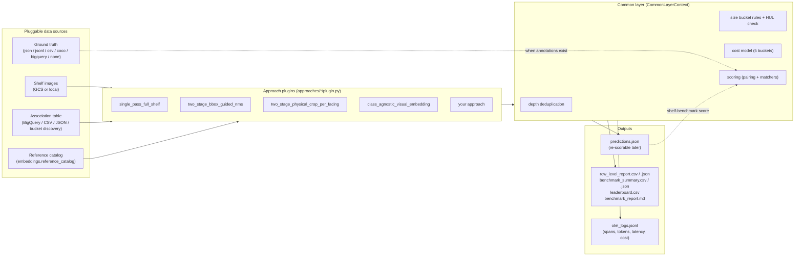

# Unilever shelf understanding: CV and VLM benchmark suite

## The problem

Given a photograph of a retail shelf, find every product facing and identify what it is.

A *facing* is one front-most visible unit in one horizontal slot. Units stacked behind it are not
facings and must not be counted twice. For each facing the suite predicts eight attributes:

`brand`, `product_name`, `category`, `subcategory`, `variant`, `packaging_type`, `pack_type`,
`size`

Those numbers feed two business questions: **share of shelf** (what fraction of facings are ours
versus a competitor's) and **planogram compliance** (is the shelf built the way it was specified).

Many approaches can do this: a single VLM call on the whole shelf, a detector followed by a
per-crop classifier, class-agnostic detection plus visual embedding lookup against a reference
catalog, a fine-tuned model, and combinations of those. This repository exists to say which one
is better, on three axes that trade off against each other: **accuracy**, **latency** and
**GCP cost**.

> [!IMPORTANT]
> Ground truth annotations do not exist yet. Runs today produce predictions, latency, tokens and
> cost, and accuracy metrics come back as `None` with
> `accuracy_status="PLACEHOLDER_AWAITING_GROUND_TRUTH"`. `None` means "not measured". It is
> deliberately not `0.0`, which would mean "measured, and the model got everything wrong". When
> annotations arrive, every past run can be re-scored for free with `shelf-benchmark score`; no
> inference is repeated.

## Start here

| If you want to | Read |
| :--- | :--- |
| Run something in the next two minutes | [Quickstart](#quickstart-no-gcp-required), below |
| Understand exactly what a metric means before you trust it | [`docs/EVALUATION_PROTOCOL.md`](file:///usr/local/google/home/rgavigan/unilever-shelf-understanding-with-cv/docs/EVALUATION_PROTOCOL.md) |
| Produce or accept annotations | [`docs/GROUND_TRUTH_CONTRACT.md`](file:///usr/local/google/home/rgavigan/unilever-shelf-understanding-with-cv/docs/GROUND_TRUTH_CONTRACT.md) |
| Add your own approach or model | [`ENGINEER_ONBOARDING_GUIDE.md`](file:///usr/local/google/home/rgavigan/unilever-shelf-understanding-with-cv/ENGINEER_ONBOARDING_GUIDE.md) |
| Copy working code | [`code_samples/`](file:///usr/local/google/home/rgavigan/unilever-shelf-understanding-with-cv/code_samples/README.md) |
| See every configurable knob, commented | [`configs/default_config.yaml`](file:///usr/local/google/home/rgavigan/unilever-shelf-understanding-with-cv/configs/default_config.yaml) |

## Quickstart (no GCP required)

Everything below runs against the bundled 600x400 fixture image with no project, no credentials
and no network.

```bash
# What approaches exist, and where each one came from.
.venv/bin/shelf-benchmark list-approaches

# The full run-now-score-later workflow, end to end, with commentary.
.venv/bin/python code_samples/10_run_now_score_later_ground_truth.py

# A benchmark run: two approaches, all artifacts written to a temp directory.
.venv/bin/python code_samples/01_quickstart_run_full_suite.py

# Check an annotation file before you trust any accuracy number computed from it.
.venv/bin/shelf-benchmark validate-gt \
  --gt-provider json \
  --ground-truth-uri configs/sample_ground_truth.json

# The test suite.
.venv/bin/pytest -q
```

In Python, the same thing:

```python
from shelf_benchmark import UniversalModelSpec
from shelf_benchmark.testing import (
    OFFLINE_IMAGE_URI, make_offline_sdk, perfect_prediction_payload,
)

sdk = make_offline_sdk("/tmp/shelf-demo")
sdk.register_model(UniversalModelSpec(
    model_id="offline-demo-model",
    display_name="offline-demo-model",
    provider_family="custom_callable",
    custom_handler=lambda prompt, image_uri, schema: perfect_prediction_payload(),
))
summary = sdk.run_suite(
    models=["offline-demo-model"],
    tasks=["classification"],
    approaches=["single_pass_full_shelf"],
    shelf_image_uri=OFFLINE_IMAGE_URI,
)
print(summary["results"][0].accuracy.accuracy_status)
```

> [!WARNING]
> Offline mode gates Cloud Storage, not model calls. Passing a real model id such as
> `gemini-3.8-flash` to `run_suite` builds a real Vertex AI client and issues a billable request
> even when `offline.enabled = True`. Register a `custom_callable` stand-in, as above, to stay
> offline.

For a live run, authenticate first (`gcloud auth application-default login`), then use a `gs://`
image and real model ids.

## The four CLI subcommands

```bash
.venv/bin/shelf-benchmark <command> [options]
```

| Command | What it does | Costs inference? |
| :--- | :--- | :--- |
| `run` | Execute the benchmark and write reports plus `predictions.json`. | yes |
| `score` | Re-score an existing `predictions.json` against ground truth. | no |
| `list-approaches` | Print every registered approach, built-in or plugin, with its id and source. | no |
| `validate-gt` | Load an annotation file, report what was parsed, and print sample entries. | no |

Invoking `shelf-benchmark` with no subcommand defaults to `run`, so older flag-only command lines
still work.

Common options: `--config`, `--output-dir`, `--offline`, `--isolated`, `--models`, `--tasks`,
`--approaches`, `--image`, `--ground-truth-uri`, `--gt-provider`, `--gt-version`, `--bbox-format`,
`--iou-threshold`.

```bash
# Run three models and two approaches on one image.
.venv/bin/shelf-benchmark run \
  --models gemini-3.8-flash gemini-3.7-flash \
  --tasks detection classification \
  --approaches single_pass_full_shelf two_stage_bbox_guided_nms \
  --image gs://unilever-shelf-understanding-shelf-images/shelf-image.png

# Months later, annotations arrive. Re-score the run you already paid for.
.venv/bin/shelf-benchmark score \
  --predictions reports/predictions.json \
  --gt-provider json \
  --ground-truth-uri gs://unilever-shelf-understanding-shelf-images/annotations_v1.json \
  --gt-version v1
```

`--approaches` accepts any registered approach id. There is no hardcoded allowlist, so a plugin
you add is usable from the CLI as soon as it is discovered; `list-approaches` is the source of
truth for what is available. An unknown id fails loudly with the list of valid ids rather than
silently running something else.

## What gets measured

### Accuracy

Predictions are paired with annotations on **geometry only**: a global best-IoU-first greedy
match at a configurable threshold (`evaluation.iou_threshold`, default `0.50`). Naming is then
scored within the matched pairs, so a box in the right place with the wrong brand is a detection
success and a classification failure, and cannot be confused for either.

| Metric | Meaning |
| :--- | :--- |
| `detection_precision` | matched predictions / all predictions |
| `detection_recall` | matched predictions / all annotated facings |
| `detection_f1` | harmonic mean of the two |
| `iou_threshold` | the threshold those three were computed at, reported alongside them |
| `mean_iou_matched` | average IoU over matched pairs only, that is, how tight the good boxes are |
| `count_accuracy` | predicted facing count versus annotated facing count |
| `brand_classification_accuracy`, `product_classification_accuracy` | strict-match rates within matched pairs |
| `brand_set_recall` | fraction of annotated brands found anywhere on the shelf |

> [!NOTE]
> These used to be called `detection_precision_iou50`, `detection_recall_iou50` and
> `detection_f1_iou50`, and the threshold in the name was wrong: the code used `0.25`. The names
> no longer encode a number, and the threshold is reported as data. Changing
> `evaluation.iou_threshold` invalidates comparison with any run scored at a different value, so
> the value is stamped on every row.

### Cost

Five buckets, of which two are measured and three are modelled:

| Bucket | Basis | Counted in the total by default |
| :--- | :--- | :--- |
| `vertex_ai_payg_tokens_usd` | measured token counts x rate card | yes |
| `vertex_ai_provisioned_throughput_usd` | reserved GSU amortised over throughput | only when provisioned throughput is enabled |
| `vertex_ai_embeddings_and_vision_usd` | measured embedding and vision calls | yes |
| `cloud_run_compute_usd` | modelled from latency and machine shape | no |
| `gcs_and_observability_usd` | modelled from operation counts and log volume | no |

`billing.include_infrastructure_costs` defaults to `false`, so the last two are reported but
excluded from headline figures: a modelled number should not move a leaderboard.
`CostMetrics.billing_source` says which rates were used, and reads `yaml_rate_table` unless live
SKU rates were genuinely fetched and parsed.

## Approaches

`shelf-benchmark list-approaches` prints the live list. At the time of writing:

| Approach id | Shape |
| :--- | :--- |
| `single_pass_full_shelf` | one VLM call classifies the whole shelf |
| `two_stage_bbox_guided_nms` | detect boxes, then classify conditioned on them |
| `two_stage_physical_crop_per_facing` | detect, crop each facing, classify each crop |
| `class_agnostic_visual_embedding` | class-agnostic detection, then embedding lookup against a reference catalog |
| `cloud_vision_visual_embedding` | the same, using Cloud Vision for the detection stage |

> [!CAUTION]
> `class_agnostic_visual_embedding` needs `embeddings.reference_catalog.source_uri` pointing at a
> catalog JSON. Without one it reports `Unknown` with `NO_CATALOG_INDEXED` rather than inventing
> brand names, which an earlier version did. `configs/demo_visual_prototypes.json` is a
> demonstration catalog only and must not be used for any published comparison.

## Ground truth

The suite is built around running before annotations exist:

1. **Run now.** Costs inference. Writes `predictions.json` alongside the reports.
2. **Annotations arrive.** Any of `json`, `jsonl`, `csv`, `coco` or `bigquery`, with arbitrary
   vendor field names mapped through `ground_truth.schema_mapping` and any of five bounding-box
   conventions declared through `bbox_format`.
3. **Verify** with `shelf-benchmark validate-gt` before trusting a single number.
4. **Re-score** with `shelf-benchmark score`. Free, repeatable, and stamped with `gt_version` so
   two annotation revisions can never be silently compared.

`configs/sample_ground_truth.json` is the canonical worked example: one image, three front-row
facings with all seven taxonomy dimensions populated, and one `back_row: true` unit that the
loader excludes. [`docs/GROUND_TRUTH_CONTRACT.md`](file:///usr/local/google/home/rgavigan/unilever-shelf-understanding-with-cv/docs/GROUND_TRUTH_CONTRACT.md)
specifies it field by field.

## Configuration

[`configs/default_config.yaml`](file:///usr/local/google/home/rgavigan/unilever-shelf-understanding-with-cv/configs/default_config.yaml)
is the discoverable list of knobs, commented inline: `evaluation` (IoU threshold, matcher
strictness, brand aliases), `ground_truth` (provider, schema mapping, all five `bbox_format`
options), `billing` (rate cards, `include_infrastructure_costs`, provisioned throughput,
embeddings and vision), `embeddings.reference_catalog`, `reporting` (`isolate_runs`,
`write_predictions_file`), `offline`, and `telemetry`.

The product taxonomy lives in
[`configs/taxonomy.yaml`](file:///usr/local/google/home/rgavigan/unilever-shelf-understanding-with-cv/configs/taxonomy.yaml):
categories, subcategories, packaging types, pack types, size-bucket rules, and the HUL and
non-HUL brand lists. Every prompt, the rule-derived size bucket and the HUL brand check read from
it, so changing a category list is a config edit and never a code edit.

## Architecture



## Observability

Every task execution creates an OpenTelemetry span and writes a structured record to
`reports/otel_logs.jsonl` via `OpenTelemetryBenchmarkLogger`: `start_time` and `end_time`
(ISO-8601 UTC plus `start_time_unix_nano` / `end_time_unix_nano`), `latency_ms`,
`gen_ai.usage.input_tokens`, `gen_ai.usage.thinking_tokens`, `gen_ai.usage.output_tokens`,
`gen_ai.usage.total_tokens`, `shelf_benchmark.cost_per_shelf_image_usd`,
`shelf_benchmark.cost_per_product_usd`, and `TraceId` / `SpanId` / `Resource`
(`service.name`, `cloud.account.id`, `cloud.region`). Export to Cloud Logging and GCS is
configurable under `telemetry`, and is off in offline mode.
