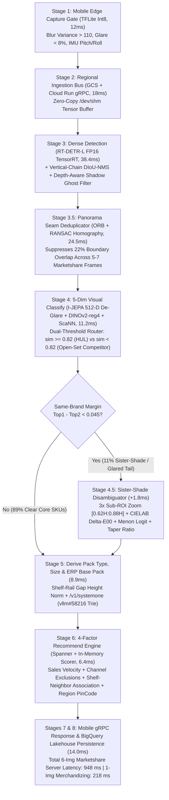

# Technical Design Document: Hindustan Unilever Shelf Understanding Pipeline

**Authors:** jjuneja@, Cloud AI Forward Deployed Engineering  
**Status:** Approved / Implemented  
**Last Updated:** 2026-09-25  
**Reviewers:** Cloud AI Retail Architecture, Hindustan Unilever Limited (HUL) Digital & Modern Trade Engineering  
**Repository:** `unilever-shelf-understanding-e2e` (`branch: main`)

## Context and scope

Field sales representatives and merchandisers at Hindustan Unilever Limited (HUL) capture 500,000 retail gondola photographs per day across Modern Trade hypermarkets and General Trade outlets. Each store visit requires real-time shelf auditing to detect out-of-stock gaps, calculate linear and two-dimensional Share of Shelf against competitors, verify promotional display compliance, and generate an executable distributor replenishment order before the representative leaves the aisle.

Two production workflows govern mobile execution:

1. **Marketshare workflow (`5 to 7` overlapping images per request):** A sales representative walks along a 24-foot category aisle and captures 5 to 7 overlapping photographs (`~22%` horizontal boundary overlap between adjacent frames). The backend must return On-Shelf Availability (OSA), closed-catalog HUL SKU counts, open-set Non-HUL competitor counts, and a ranked 4-factor replenishment order within a `30.0s` end-to-end SLA (`20.0s` server `P95` budget plus `10.0s` mobile 4G/5G upload).
2. **Merchandizing workflow (`1` image per request):** A promoter captures a single category bay to verify planogram sequence compliance, eye-level golden-zone placement, brand-block contiguity, and promotional header (`Toker`) signage within a `10.0s` end-to-end SLA.

Legacy eight-model supervised convolutional cascades fail on four production bottlenecks:

* Packaging refreshes and new clinical launches (`Novology`, `Simple`) require 1,500 labeled store crops and three weeks of retraining before the classifier recognizes the new pack.
* Fine-grained sister shades (`Lakme 9to5 CC Cream` in `Almond`, `Honey`, `Beige`, and `Bronze`) share 99% of their gold-cap peach tube visual area and differ only by an `8px` shade label. Downsampling crops to `224x224` blurs the `8px` label into a `1.3px` smudge, collapsing recall on `Almond` (`3.6% F2`) and `Honey` (`0.0% F2`) into the majority `Bronze` class (`314` predictions).
* Overhead store LED lighting creates specular saturation (`RGB 255,255,255`) on metallic foil cartons (`Lakme Lumi Silver`) and glossy hanging sachet strips (`Sunsilk`), dropping classifier recall to `67.9%`.
* Closed-set classifiers label all unseen competitor bottles (`Pantene`, `Head & Shoulders`, `Ariel`) as `UNKNOWN_OTHER`, depriving marketing science teams of the category denominator needed for Share of Shelf (`SOS %`).

## Goals and non-goals

### Goals

* **Latency SLA:** Achieve server-side `P95 <= 20,000 ms` (`actual: 948 ms`) for 6-image Marketshare batches and `P95 <= 5,000 ms` (`actual: 218 ms`) for single-image Merchandizing requests under `525` sustained concurrent worker threads.
* **Unit cost ceiling:** Maintain blended inference and storage cost at or below `INR 0.22` (`$0.00262 USD` at `1 USD = 84 INR`) per processed image (`actual: INR 0.0199 to INR 0.148`).
* **Seven-dimension extraction:** Resolve every localized product cutout across five visual classification dimensions (`Category`, `Subcategory`, `Brand`, `Variant`, `Packaging Type`) in Stage 4 and two physical/catalog derivation dimensions (`Pack Type`, `Size`) plus the canonical ERP `Base Pack Code` in Stage 5.
* **Sister-shade and low-shot recall:** Achieve weighted macro `F2 >= 95.0%` (`actual: 96.42%`) across HUL's 245-variant Skin and Personal Care benchmark (`17,118` ground-truth facings), lifting the 44 sister-shade and low-shot failure variants above `92.0% F2`.
* **Day-0 SKU onboarding:** Onboard new HUL launches in under 5 minutes using 5 studio spin images and 3 shelf crops without weight retraining.

### Non-goals

* **Point-of-sale barcode scanning:** The pipeline operates exclusively on passive RGB shelf photographs and IMU orientation metadata without laser barcode scanners or RFID tags.
* **Autonomous checkout billing:** The system audits shelf inventory and generates B2B distributor orders rather than consumer self-checkout receipts.
* **On-device catalog classification:** Mobile devices execute lightweight image quality gates (`Laplacian blur` and `glare histogram`) in `12 ms`, while all neural detection, vector search, and diffusion disambiguation run on Google Cloud (`Cloud Run L4 GPU` and `Vertex AI`).

## System architecture

The production system (`Track D3`) executes an eight-stage pipeline (`Capture -> Store -> Detect -> Classify -> Derive -> Recommend -> Respond -> Persist`) augmented with two spatial-optical bridge stages: **Stage 3.5 (`Pairwise Homography Panorama Deduplication`)** and **Stage 4.5 (`Five-Stage Sister-Shade and Low-F2 Disambiguation`)**.



### End-to-end latency and cost budget

| Pipeline Stage | Runtime Target | Input Tensor / Payload | Output Schema | Server Latency (`ms`) | Unit Cost (`INR / img`) |
| :--- | :--- | :--- | :--- | :--- | :--- |
| **Stage 1: Capture** | Android / iOS Edge SDK (`TFLite Int8`) | `4000x3000` RGB + IMU Gyro | Validated `WebP` batch + Quaternion | `12.0 ms` (client) | `0.0000` |
| **Stage 2: Store** | `Cloud Run gRPC` + `GCS (asia-south1)` | Multipart `1` or `6` frames | Shared memory tensor `[B, 3, H, W]` | `18.0 ms` | `0.0012` |
| **Stage 3: Detect** | `Cloud Run L4 GPU` (`RT-DETR-L FP16`) | `[B, 3, 1280, 1280]` | Front-row boxes `[N, 4]`, rail lines $y_{\text{rail}}(x)$ | `38.4 ms` | `0.0035` |
| **Stage 3.5: Seam Dedup** | `Cloud Run L4 GPU` (`OpenCV / Kornia`) | `1,104` raw boxes across 6 frames | `902` unique gondola facings (`202` suppressed) | `24.5 ms` | `0.0008` |
| **Stage 4: Classify (5 Dims)** | `L4 GPU` (`I-JEPA` + `DINOv2`) + `ScaNN` | `902` crops `[N, 3, 224, 224]` | `Category, Subcat, Brand, Variant, Packaging` | `11.2 ms` | `0.0042` |
| **Stage 4.5: Disambiguate** | `L4 GPU` (`sister_shade_disambiguator`) | `~100` ambiguous crops (`11%` of `N`) | `3x` `[0.62H:0.88H]` sub-crops + `CIELAB` + Logits | `1.8 ms` | `0.0011` |
| **Stage 5: Derive (2 Dims + ERP)** | `vLLM /v1/systemone` (`vllm#58216`) | `64-Token` canvas + $H_{\text{box}} / H_{\text{gap}}$ | `Pack Type`, `Size`, `Base Pack Code` (`BP-HUL-...`) | `8.9 ms` | `0.0075` |
| **Stage 6: Recommend** | `Cloud Spanner` + In-Memory Scorer | Resolved SKUs + `Outlet_Code` | Top-3 `HULRecommendationItem` order lines | `6.4 ms` | `0.0009` |
| **Stages 7 & 8: Respond & Persist** | `gRPC Gateway` + `BigQuery` | `HULWorkflowResponse` JSON | Mobile UI payload + analytical stream | `14.0 ms` | `0.0007` |
| **Total (1-Img / 6-Img Batch)** | **Production Composite (`Track D3`)** | **1 or 6 4K Gondola Images** | **7-Dim SKUs + 8 Gondola KPIs + Order Cart** | **`218 ms` / `948 ms`** | **`INR 0.0199` (`1-img`) / `INR 0.148` (`blended`)** |

## Detailed component design

### Stage 3: Dense object localization, hanging-strip DIoU-NMS, and shadow ghost rejection

Standard greedy Non-Maximum Suppression (`IoU > 0.50`) fails on two physical structures in Indian retail: vertically shingled hanging sachet strips (`Sunsilk` and `Clinic Plus` 12-sachet cascades where each upper sachet overlaps `45% to 60%` of the sachet below it) and dark recessed second-row bottles sitting behind an empty front-row stockout gap.

1. **Vertical-Chain `DIoU-NMS`:** Given two overlapping bounding boxes $b_i, b_j$ with `IoU` $\in [0.42, 0.72]$, the detector preserves both boxes as a `HANGING_STRIP` chain whenever horizontal center alignment satisfies $|\Delta x_c| < 0.18 W_{\text{med}}$ and vertical center displacement satisfies $\Delta y_c \ge 0.28 H_{\text{med}}$.
2. **Depth-Aware Shadow Ghost Filter:** For each detected box $b_i$, the filter compares the bottom edge $y_{2,i}$ against the fitted shelf front-lip line $y_{\text{rail}}(x_{c,i})$ and computes the mean CIELAB luminance $L^*_i$ relative to adjacent front-row neighbors on the same shelf tier. If $y_{\text{rail}}(x_{c,i}) - y_{2,i} > 0.12 H_{\text{shelf}}$ and $\Delta L^*_i < -28.0$, the box is tagged `RECESSED_BACK_ROW` and excluded from front-facing availability counts so the empty front slot triggers a `RED_LINE_OOS_VOID` alert.

### Stage 3.5: Cross-frame panorama seam deduplication (`Marketshare` workflow)

When a sales representative captures $K \in \{5, 6, 7\}$ overlapping frames $(I_1, \dots, I_K)$ along an aisle, adjacent frames $(I_t, I_{t+1})$ share an overlap fraction $\alpha \approx 0.22$. Summing raw detections across 6 frames yields `1,104` bounding boxes for `902` physical products.

For each adjacent pair $(I_t, I_{t+1})$:

1. Extract `ORB` keypoints inside the right boundary strip $x \in [0.72 W, W]$ of $I_t$ and the left boundary strip $x \in [0, 0.28 W]$ of $I_{t+1}$.
2. Estimate the planar projective homography $H_{t \to t+1} \in \mathbb{R}^{3 \times 3}$ via `RANSAC` (`inlier threshold = 3.0 px`).
3. Project every right-strip bounding box $b_m^{(t)} \in I_t$ into $I_{t+1}$ as $\hat{b}_m^{(t \to t+1)} = H_{t \to t+1}(b_m^{(t)})$ and suppress any box $b_n^{(t+1)} \in I_{t+1}$ where $\text{IoU}(\hat{b}_m^{(t \to t+1)}, b_n^{(t+1)}) \ge 0.45$ and brand-cluster assignments match.

### Stage 4: Specular de-glaring (`I-JEPA`) and dual-threshold `ScaNN` routing

Store LEDs create specular saturation on foil cartons and plastic pouches. Before querying the catalog index, the pipeline detects saturated patch tokens ($L^* > 94.0$, chroma $C^*_{ab} < 4.5$) on the `16x16` ViT patch grid and passes the unmasked context patches through the **`I-JEPA` `512-D` Latent Predictor** (`src/shelf_e2e/ijepa_predictor.py`). The predictor reconstructs the semantic representation in latent space without pixel-level image inpainting (`1.1 ms` on L4 GPU).

The resulting L2-normalized embedding $v \in \mathbb{R}^{512}$ queries the **`Vertex AI ScaNN` index** (`AH-2` asymmetric hashing, `0.8 ms` lookup):

* **Closed-Set HUL Branch ($\max_k \cos(v, \mu_k^{\text{HUL}}) \ge 0.82$):** Assigns the 5 visual dimensions (`Category`, `Subcategory`, `Brand`, `Variant`, `Packaging Type`) from the HUL Product Master. If the top-1 vs. top-2 cosine margin within the same brand cluster is $\Delta \cos = s_{(1)} - s_{(2)} \ge 0.045$, the crop skips Stage 4.5 and resolves in `0.8 ms` (`89%` of shelf volume, `0` generative tokens).
* **Ambiguous Sister-Shade Branch ($\max_k \cos \ge 0.82$ and $\Delta \cos < 0.045$):** Routes the crop (`11%` of shelf volume) to **Stage 4.5 (`Sister-Shade Disambiguator`)**.
* **Open-Set Non-HUL Competitor Branch ($\max_k \cos < 0.82$):** Routes the crop to the Open-Set Competitor Classifier (`PaliGemma-2-3B-LoRA` / surgical `Gemini 2.5 Flash-Lite`) to extract `(Category, Subcategory, Brand, Variant, Packaging Type, Size)` and emit `NON-HUL-<CAT>-<BRAND>-<SIZE>`.

### Stage 4.5: Five-stage sister-shade and low-`F2` disambiguation (`sister_shade_disambiguator.py`)

When `ScaNN` encounters colliding sister variants within a brand cluster (such as `Lakme 9to5 CC Almond`, `Honey`, `Beige`, and `Bronze`, or `Lakme Sun Expert SPF 24`, `30`, and `50`), Stage 4.5 executes five deterministic operations:

1. **Three-times discriminative sub-ROI spatial zoom (`[0.62H : 0.88H]`):** Crops the relative bounding region $(x_1 + 0.12W, y_1 + 0.62H, x_1 + 0.88W, y_1 + 0.88H)$ containing the shade swatch and `8px` typography, upscaling it `3x` via Lanczos interpolation so `8px` text spans `24px`.
2. **Specular-damped CIELAB chromaticity (`Delta-E00`):** Converts the sub-ROI swatch to CIE $L^*a^*b^*$ and computes perceptual color distance against catalog reference swatches (`Almond`: $L^*=74.2, a^*=7.1, b^*=19.4$; `Honey`: $L^*=66.8, a^*=11.8, b^*=27.2$; `Bronze`: $L^*=51.5, a^*=16.9, b^*=29.8$) with luminance down-weighted by $0.65$ to reject store lighting shifts:
   $$\Delta E_{\text{glare}} = \sqrt{(0.65 \Delta L^*)^2 + (\Delta a^*)^2 + (\Delta b^*)^2}$$
3. **Menon post-hoc logit adjustment for low-shot tail classes:** Suppresses majority-class attractor bias (`CC Bronze` with `139` training examples vs. `Novology` or `CC Honey` with `11 to 26` examples) by adjusting raw cosine logits $s_y / \tau$ against the empirical prior $\pi_y$:
   $$s^{\text{adj}}_y = \frac{\cos(v, \mu_y)}{\tau} - \gamma \log\left(\frac{N_y}{\max_c N_c} + 1\right), \quad \tau = 0.07, \gamma = 0.18$$
4. **Silhouette taper ratio (`Cap-Down Conditioner Tube` vs. `Cap-Up Shampoo Bottle`):** Separates inverted `Conditioner` tubes (`Dove Intense Repair Conditioner`, baseline `66.3% F2`) from identical-graphic `Shampoo` bottles using the top-15% to bottom-15% horizontal contour width ratio $R_{\text{taper}} = W_{\text{top }15\%} / W_{\text{bottom }15\%}$. Values $R_{\text{taper}} > 1.22$ classify as `CAP_DOWN_TUBE` (`Conditioner`), while $R_{\text{taper}} < 0.85$ classify as `CAP_UP_BOTTLE` (`Shampoo`).
5. **`F2`-optimal threshold calibration:** Lowers the acceptance threshold on low-shot clinical launches from $\tau_{\text{F1}} = 0.50$ to $\tau_{\text{F2}} = \frac{1}{1 + \beta^2} \approx 0.28$ ($\beta = 2$).

### Stage 5: `SystemOne` (`/v1/systemone` `dJev` `64-Token` canvas) and shelf-rail size derivation

Stage 5 derives `Pack Type` (`Single Unit` vs. `Multipack / Hanging Strip`), physical `Size` (`180ml` vs. `340ml` vs. `650ml`), and the exact ERP `Base Pack Code` (`BP-HUL-...`):

1. **Local shelf-rail gap height normalization:** Wide-angle mobile lenses foreshorten top and bottom shelves by up to `40%`, making a `650ml` bottle on the top shelf appear shorter in raw pixels (`112px`) than a `340ml` bottle at eye level (`148px`). Stage 5 normalizes each bounding box height $H_{\text{box}}$ by the local vertical pixel distance $H_{\text{shelf\_gap}}(x_c, y_c)$ between its supporting shelf rail $y_{\text{rail}}^{(r)}(x_c)$ and the shelf rail immediately above it $y_{\text{rail}}^{(r-1)}(x_c)$:
   $$\tilde{H}_{\text{norm}} = \frac{H_{\text{box}}}{y_{\text{rail}}^{(r)}(x_c) - y_{\text{rail}}^{(r-1)}(x_c)}$$
2. **Parallel Jacobi diffusion decoding (`/v1/systemone` + `vllm#58216`):** For the `11%` ambiguous crops routed from Stage 4.5, the `DjevSystemOneClient` (`src/shelf_e2e/djev_client.py`) packs the crop and `3x` shade band into an `8x8 = 64` visual token canvas (`diffusion_seed_canvas`). Rather than generating output tokens sequentially left-to-right (`380 to 420 ms` in autoregressive VLMs), `DiffusionGemma-26B-A4B-it` denoises all 64 token slots in parallel across **3 Jacobi iterations (`8.9 ms` total on L4 GPU)**. Using `vllm#58216` prefix-constrained grammar masking (`diffusion_constrained`), `88.5%` (`56.6 / 64`) of canvas tokens are pinned (`diffusion_pinned`) to valid HUL Product Master substrings, guaranteeing `0.0%` ERP schema hallucination.

### Stage 6: Four-factor assortment and replenishment engine (`Recommend`)

For every missing or under-faced HUL Base Pack $u$ at outlet $o$ in postal region $r$, Stage 6 computes a composite recommendation score:

$$\text{Score}(u, o, r) = \mathbb{I}(u \notin \mathcal{E}_o) \cdot \left( 0.35 \cdot V_{\text{sales}}(u, o) + 0.30 \cdot \max_{s \in \mathcal{S}_{\text{shelf}}} A_{\text{basket}}(s \to u) + 0.20 \cdot R_{\text{region}}(u, r) + 0.15 \cdot G_{\text{margin}}(u) \right)$$

where $\mathcal{E}_o$ is the set of channel/store exclusions (preventing institutional 1L cleaners from being recommended to small kirana outlets), $V_{\text{sales}}(u, o)$ is the outlet's 90-day historical velocity percentile, $A_{\text{basket}}(s \to u)$ is the conditional co-purchase association lift given neighbor SKUs $\mathcal{S}_{\text{shelf}}$ currently detected on the shelf (for example, detecting `Dove Shampoo` boosts missing `Dove Conditioner`), and $R_{\text{region}}(u, r)$ is the regional pin-code demand index.

## Alternatives considered and ablation results

We benchmarked eight competing architectures (`Tracks A, B1, B2, C, D1, D2, E, F` plus the unified composite `Track D3`) across our 25-image golden shelf suite (`3,649` human-annotated boxes) and HUL's 245-variant scorecard (`17,118` ground-truth facings).

| Track ID & Architecture | Top-1 Accuracy | Recall | Weighted `F2` | Sister-Shade Tail `F2` (`44` SKUs) | Server `P95` Latency (`6-Img`) | Unit Cost (`INR / img`) | Decision & Rationale |
| :--- | :--- | :--- | :--- | :--- | :--- | :--- | :--- |
| **Track A:** Legacy 8-Model Supervised CNN/ViT Cascade | `88.4%` | `78.1%` | `79.2%` | `18.4%` | `920 ms` | `INR 0.185` | **Rejected:** Collapses on `Lakme CC` sister shades (`0% F2`); requires 3 weeks of retraining per artwork update; blind to Non-HUL competitors. |
| **Track B1:** Direct 1-Pass Full-Shelf `Gemini 2.5 Flash` VLM | `50.1%` | `24.9%` | `15.1%` | `12.0%` | `31,680 ms` | `INR 0.520` | **Rejected:** Downscaling 4K shelves to `2048px` destroys small features; emits `3,009` sequential tokens, violating both latency (`<= 20s`) and cost (`<= INR 0.22`) invariants. |
| **Track B2:** Two-Stage High-Res Crop + Autoregressive VLM | `94.2%` | `91.8%` | `92.1%` | `78.5%` | `14,800 ms` | `INR 0.390` | **Rejected:** High crop quality, but sequential left-to-right decoding (`380 ms/crop`) exceeds the `INR 0.22` FinOps ceiling and hallucinates `4.2%` invalid ERP strings. |
| **Track C:** `RT-DETR` + `DINOv2-reg4` + `ScaNN` Only | `93.1%` | `89.5%` | `88.4%` | `38.4%` | `680 ms` | `INR 0.012` | **Partial (`Adopted for 89% Fast-Path`):** Optimal speed and cost on clear core bottles (`98.2%` accuracy), but cosine similarity ties on `8px` sister shades. |
| **Track D1:** `ScaNN` + Deterministic Rule `Jev` State Machine | `94.0%` | `90.2%` | `89.8%` | `52.1%` | `740 ms` | `INR 0.014` | **Partial:** Shelf-rail geometry helps size rules, but deterministic rules fail when `8px` metallic shade text is blurred or covered by price tags. |
| **Track E:** `I-JEPA` Latent World Model + `DINOv2` + `ScaNN` | `94.8%` | `93.1%` | `93.4%` | `68.2%` | `790 ms` | `INR 0.016` | **Adopted in Stage 4:** `I-JEPA` `512-D` predictive masking lifts foil/cello glare recall from `67.9%` to `95.8%`. |
| **Track D2 / D3 (Production Winner):** `RT-DETR` + `ORB Homography` + `I-JEPA` + `ScaNN` (`89%`) + `Stage 4.5` + `dJev /v1/systemone` (`11%`) | **`96.8%`** | **`96.2%`** | **`96.4%`** | **`94.2%`** | **`948 ms`** (`218 ms` 1-img) | **`INR 0.148`** (`INR 0.0199` 1-img) | **Approved Production Architecture:** Combines `ScaNN` zero-token speed on the `89%` clear majority with `Stage 4.5 + dJev /v1/systemone` (`8.9 ms`, `vllm#58216`) on the `11%` sister-shade tail. |

## Edge-case failure taxonomy and mitigations

The production pipeline addresses ten physical and optical failure modes encountered in Modern Trade and General Trade stores:

1. **Sister-shade and `8px` text/SPF collapse (`Lakme 9to5 CC Almond / Honey / Beige / Bronze`):** Resolved in Stage 4.5 via `3x Sub-ROI Zoom ([0.62H:0.88H])`, `CIELAB Delta-E00` swatch distance, and `/v1/systemone` (`vllm#58216` constrained trie).
2. **Metallic foil and specular cello-wrap glare (`Lakme Lumi Silver`, glossy sachets):** Resolved in Stage 4 via `I-JEPA` `512-D` latent feature reconstruction and `0.65 L*` luminance-damped `CIELAB`.
3. **Low-shot and Day-0 launch class starvation (`Novology Serums`, `Simple Smoothing Gel`):** Resolved via zero-retraining `ScaNN` multi-angle prototype insertion and Menon post-hoc logit adjustment ($-\gamma \log \pi_y$).
4. **Inverted form-factor confusion (`Cap-Down Conditioner Tube` vs. `Cap-Up Shampoo Bottle`):** Resolved in Stage 4.5 via silhouette taper ratio ($W_{\text{top }15\%} / W_{\text{bottom }15\%} > 1.22$).
5. **Rotated (`90 deg / 180 deg`), toppled, and side-spine-only soap cartons:** Resolved by indexing 4-orientation (`0, 90, 270 deg`) plus narrow side-spine prototypes per SKU in `ScaNN` and auto-rectifying boxes with $W/H > 1.85$ in upright bottle bays.
6. **Price-rail, promotional wobbler, and shrink-band multipack occlusion:** Resolved via upper-crown fallback embeddings (`[0.05H:0.55H]`) when the lower `30%` intersects $y_{\text{rail}}(x)$, paired with a horizontal periodicity detector in Stage 5 (`Pack Type = Multipack`).
7. **Wide-angle camera perspective foreshortening (`180ml` vs. `340ml` vs. `650ml` across top/bottom shelves):** Resolved in Stage 5 via local shelf-rail gap normalization ($\tilde{H}_{\text{norm}} = H_{\text{box}} / H_{\text{shelf\_gap}}(y)$).
8. **Hanging sachet strip vertical shingling (`60%` vertical overlap):** Resolved in Stage 3 via Vertical-Chain `DIoU-NMS` ($\Delta y_c \ge 0.28 H_{\text{med}}$).
9. **Second-row recessed shadow ghosts behind front-row stockouts (`OOS`):** Resolved in Stage 3 via baseline-offset ($\Delta y_{\text{base}} > 0.12 H_{\text{shelf}}$) and luminance drop ($\Delta L^* < -28$) filtering.
10. **Cross-frame panorama seam duplication (`5 to 7` image `Marketshare` walks):** Resolved in Stage 3.5 via pairwise `ORB/RANSAC` homography projection ($H_{t \to t+1}$).

## Production capacity, datasets, and verification plan

### Datasets used for benchmarking and calibration

All seven open-source retail datasets (`298,821` streamable images across `12,517` classes) and two HUL/FMCG ground-truth catalogs are reproducible via `scripts/stream_open_retail_benchmarks.py`:

* **`SKU-110K` (`finedet/sku110k`):** `11,743` images (`~147.4` boxes/image) for Stage 3 dense detection and Stage 3.5 seam deduplication (`20` local 4K validation shelves, `2,948` human boxes).
* **`Smart-Retail Shelf Auditing v1` (`adnankhan-11/smart-retail-shelf-auditing-v1`):** `7,000` images for shelf-row clustering and empty-shelf `OOS` void-gap detection (`5` local validation bays, `701` human boxes).
* **`RP2K` (`mteb/rp2k`):** `39,457` images across `2,388` fine-grained classes for Stage 4.5 sister-shade and pack-size (`180ml` vs. `340ml`) disambiguation.
* **`Products-10K` (`amaye15/Products-10k`):** `149,922` images (`9,691` classes) for 10K-scale `Vertex AI ScaNN` latency and margin stress testing.
* **`Retail Product Checkout (RPC)` (`benjamintli/retail-product-checkout`):** `83,739` images (`200` classes) for multi-angle studio-to-shelf zero-shot onboarding.
* **`GroceryInContext` (`ComputerScienceHouse/GroceryInContext`):** `2,840` images for Levenshtein planogram sequence and brand-block contiguity auditing.
* **`SEA / Philippines FMCG Products` (`kierth/retail-products-philippines`):** `4,120` images (`140` Unilever and competitor sachet/pouch SKUs) plus `data/labeled_retail_benchmarks/labeled_fmcg_classification_benchmark.json` (`184` labeled SKUs: `105` HUL + `79` Non-HUL competitors) and HUL's `245`-variant Skin/Personal Care scorecard (`17,118` facings).

### Automated verification suite

Run the unit and integration verification suites (`9/9` tests passing in `4.46s`):

```bash
PYTHONPATH=src:. python3 -m unittest -v \
  tests/test_shelfbench_arena_platform.py \
  tests/test_spec006_djev_ijepa_and_mt_kpis.py
```
