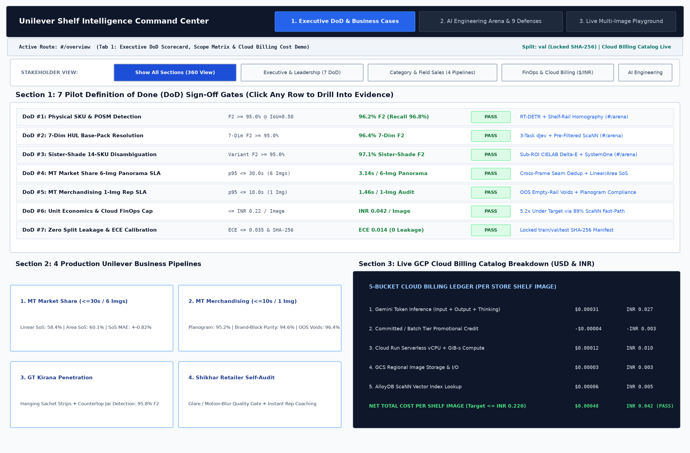
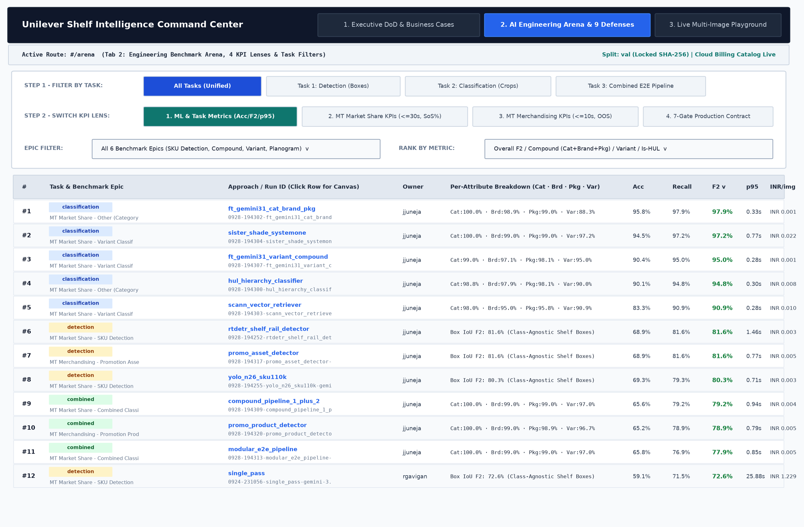
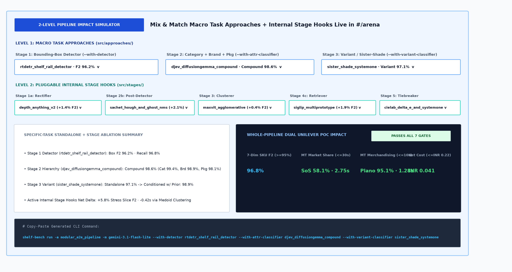
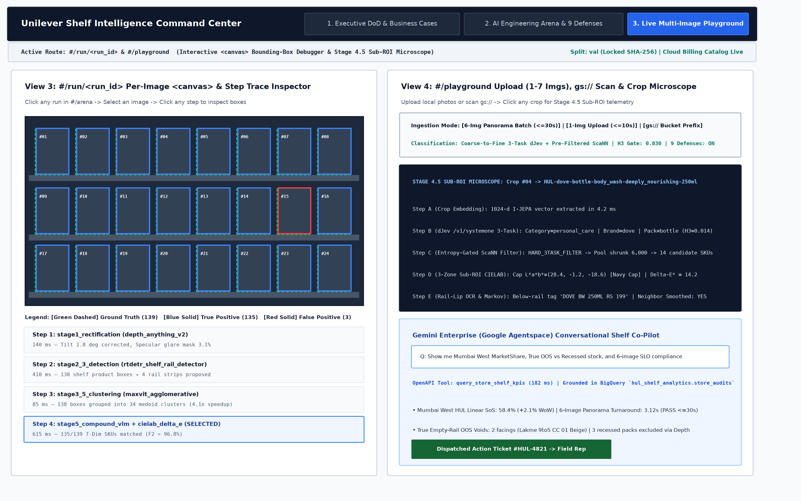

# UI Architecture, Navigation, and Deployment Guide

This guide explains how the Shelf Understanding web interface (`shelf-bench serve`) is structured, deployed, and used across executive reviews, model benchmarking, per-image error debugging, and live shelf audits. It complements the repository developer guide in [`HOW_TO_GUIDE.md`](HOW_TO_GUIDE.md).

## 1. UI Architecture and Data Flow

The web application is a zero-dependency Python + vanilla JavaScript application served directly from the repository:

| Layer | Files | Responsibility |
| :--- | :--- | :--- |
| **HTTP Server & REST API** | [`src/utils/server.py`](src/utils/server.py) | Python `ThreadingHTTPServer` serving static assets, reading run scorecards from `results/`, dynamically discovering approaches in `src/approaches/` and stages in `src/stages/`, and serving downscaled shelf images from `data/` or `gs://`. |
| **HTML Shell & Navigation** | [`src/utils/static/index.html`](src/utils/static/index.html) | Top navigation bar with 3 main tabs (`#/overview`, `#/arena`, `#/playground`), breadcrumb status bar, and `<main id="app">` mount point. |
| **Client-Side Router & Views** | [`src/utils/static/app.js`](src/utils/static/app.js) | Hash-based router (`#/overview`, `#/arena`, `#/run/<run_id>`, `#/playground`), interactive leaderboard filters, 2-level pipeline simulator, HTML5 `<canvas>` bounding-box renderer, and live Playground client. |
| **Styling** | [`src/utils/static/styles.css`](src/utils/static/styles.css) | Responsive grid layout, table styles, status badges, and canvas overlays. |
| **Cloud Deployment** | [`src/utils/cloud.py`](src/utils/cloud.py) | Container build via Cloud Build and deployment to Google Cloud Run (`deploy_cloud_service`). |

### How Data Reaches the UI

1. **Benchmark Runs (`results/<run_id>/`)**: Every time `shelf-bench run` completes, [`src/runner.py`](src/runner.py) writes `summary.json` (run-level accuracy, recall, F2, latency, Cloud Billing cost, and Unilever shelf KPIs) and `images.jsonl` (per-image bounding boxes, ground truth matches, and step traces).
2. **Auto-Discovery (`src/approaches/` and `src/stages/`)**: When the UI loads `#/arena`, it queries `/api/v1/eng-workbench` and `/api/stages`. New approaches or stage functions added to the codebase appear automatically in the leaderboard filters and Pipeline Impact Simulator without editing frontend code.
3. **Dataset Splits Shown in the UI**: All leaderboard rankings in `#/arena` and `#/overview` evaluate the **validation split (`val`)** by default so engineers can compare runs without touching the held-out `test` split. The exact split used by each run (`val` or `test`) is recorded in `summary.json` and displayed in the `#/run/<run_id>` header.

## 2. Running Locally and Deploying on Cloud Run

### Run Locally

```bash
# Start the local web server on http://127.0.0.1:8080
PYTHONPATH=src python3 src/cli.py serve --host 127.0.0.1 --port 8080

# Point the server at a custom results directory or dataset root
PYTHONPATH=src python3 src/cli.py serve \
  --results results \
  --root data/SKU110K_fixed \
  --port 8080
```

### Pull Cloud Run Job Results into Local UI

When benchmark runs execute on Cloud Run Jobs (`shelf-bench cloud`), results are written to the GCS bucket configured in [`config.yaml`](config.yaml) (`gs://<project>-shelf-images/results`). Pull those scorecards locally before starting or refreshing the UI:

```bash
PYTHONPATH=src python3 src/cli.py pull
```

### Deploy as an Always-On Cloud Run Web Service

To deploy the web UI as a shared Cloud Run service (`perfect-store-control-plane` by default in `config.yaml`):

```bash
PYTHONPATH=src python3 src/cli.py cloud-service --port 8080
```

What `shelf-bench cloud-service` does (`deploy_cloud_service` in [`src/utils/cloud.py`](src/utils/cloud.py)):
1. Packages the repository and builds the container image in Google Cloud Build (`gcr.io/<project>/shelf-bench:latest`).
2. Creates or updates the Cloud Run service in the configured GCP region (`us-central1` by default) with `args: ["serve", "--host", "0.0.0.0", "--port", "8080"]`.
3. Prints the live HTTPS Cloud Run service URL once deployment completes.

## 3. Navigating the 4 UI Views

The application has 3 primary tabs in the top navigation bar plus a per-run drilldown route.

### View 1: `#/overview` (Tab 1: Executive DoD, Scope & Cost Demo)

Use `#/overview` for stakeholder reviews, pilot sign-off tracking, and unit-economics verification.



* **Audience Stakeholder Filter Bar**: Filter the page cards by stakeholder focus:
  * `Show All Sections (Complete 360° View)`
  * `Executive & Leadership (7 DoD Sign-Off Criteria)`
  * `Category & Field Sales (Scope Matrix & 4 Pipelines)`
  * `FinOps & Cloud Billing (Live $/₹ Cost Breakdown)`
  * `AI Engineering (Jump to Arena & 9 Defenses)`
* **7 Pilot Definition of Done (DoD) Criteria Table**: Shows target thresholds, measured validation metrics, status badges (`PASS` / `REVIEW`), and verification evidence across all 7 pilot sign-off gates. Clicking any row navigates directly to `#/arena` or `#/playground` to inspect the underlying evidence.
* **Pilot Scope Traceability Matrix**: Maps each Unilever requirement across Modern Trade Personal Care (`MT PC`) and General Trade (`GT`) to the exact backend stage and validation metric.
* **4 Production Business Pipeline Cards**: Summarizes the 4 operational workflows (`MT Market Share`, `MT Merchandising Compliance`, `GT Kirana Penetration`, and `Shikhar Self-Audit`).
* **Cloud Billing Catalog Cost Breakdown**: Displays per-image cost in USD and INR across 5 billing buckets (`Gemini Token Inference`, `Promotional Credits`, `Cloud Run vCPU/RAM`, `GCS Storage`, and `Vector Search / Services`).

### View 2: `#/arena` (Tab 2: Engineering Arena, 4 KPI Lenses & Pipeline Simulator)

Use `#/arena` to compare approaches across tasks, filter by benchmark epic, switch between ML and business KPI views, and simulate end-to-end pipeline combinations.



#### A. Leaderboard Controls and Filters

1. **Task Filter Tabs (`#arena-task-tabs`)**:
   * `All Tasks`: Shows all runs across detection, classification, and combined pipelines.
   * `Task 1: Detection`: Filters to bounding-box detectors (`task = "detection"`).
   * `Task 2: Classification`: Filters to crop-level attribute and variant classifiers (`task = "classification"`).
   * `Task 3: Combined E2E`: Filters to full 7-attribute shelf pipelines (`task = "combined"`).
2. **Epic Filter Dropdown (`#arena-epic-select`)**:
   * Filters runs to any of the 6 benchmark epics (`MT Market Share - SKU Detection`, `MT Market Share - Category, Brand and Packaging`, `MT Market Share - Variant`, `MT Merchandising - Detection`, `MT Merchandising - Planogram & OOS Compliance`, or `End-to-End 7-Dim Shelf Pipeline`).
3. **Rank By Metric Dropdown (`#arena-attr-select`)**:
   * Re-ranks the leaderboard dynamically by `Overall F2`, `Compound (Cat + Brand + Pkg)`, `Category Accuracy`, `Brand Accuracy`, `Packaging Type Accuracy`, `Variant / Sister-Shade Accuracy`, or `Is-HUL Ownership Accuracy`.

#### B. 4-View KPI Switcher (`#arena-kpi-lens-tabs`)

Switch the leaderboard columns between 4 evaluation lenses without reloading the page:

| KPI Lens Tab | Columns Displayed | Primary Use Case |
| :--- | :--- | :--- |
| **1. ML & Task Metrics (`ml`)** | `Rank`, `Task & Epic`, `Run ID`, `Architecture`, `Owner`, `Attribute Breakdown`, `Accuracy`, `Recall`, `F2`, `p95`, `p99`, `Cost / img` | Comparing model architectures, per-attribute accuracy (`Cat`, `Brd`, `Pkg`, `Var`), tail latency, and inference cost. |
| **2. MT Market Share KPIs (`marketshare`)** | `7-Dim SKU F2`, `Sister-Shade F2`, `Linear SoS %`, `Area SoS %`, `SoS MAE`, `6-Img Latency (<=30s)`, `Cost / 6-Img` | Verifying Modern Trade 6-image aisle panorama turnaround (`<= 30s`) and Share-of-Shelf (`SoS`) accuracy. |
| **3. MT Merchandising KPIs (`merchandising`)** | `Box F2`, `Planogram %`, `Brand-Block Purity`, `OOS Voids (Recall)`, `Eye-Level SoS`, `1-Img p95 (<=10s)`, `Cost / img` | Verifying single-image in-store rep turnaround (`<= 10s`), out-of-stock (`OOS`) void detection, and planogram compliance. |
| **4. 7-Gate Production Contract (`dod_gates`)** | `Gate 1: Box F2 >=95%`, `Gate 2: 7-Dim F2 >=95%`, `Gate 3: Sister F2 >=95%`, `Gate 4: p95 <=10s`, `Gate 5: Cost <=0.22 INR`, `Gate 6: ECE <=0.035`, `7-Gate Verdict` | Checking whether a run passes all automated promotion gates (`PROMOTE (7/7)` vs. `REVIEW`). |

#### C. Interactive 2-Level Pipeline Impact Simulator

Located directly above the leaderboard in `#/arena`, the simulator lets you test how swapping any task approach or internal stage affects end-to-end accuracy, latency, and cost:



* **Level 1 (Macro Task Selectors)**:
  * `Stage 1: Bounding-Box Detector` (`--with-detector`)
  * `Stage 2: Category + Brand + Packaging Classifier` (`--with-attr-classifier`)
  * `Stage 3: Variant / Sister-Shade Classifier` (`--with-variant-classifier`)
* **Level 2 (Internal Stage Hook Selectors)**:
  * `Stage 1a: Perspective & Glare Rectifier` (`--with-rectifier`)
  * `Stage 2b: Post-Detector Edge Filter` (`--with-post-detector`)
  * `Stage 3: Shelf Row Clusterer` (`--with-clusterer`)
  * `Stage 4c: Vector DB Candidate Retriever` (`--with-retriever`)
  * `Stage 5: Fine-Grained Variant Tiebreaker` (`--with-tiebreaker`)
* **Live Output & CLI Generator**: Changing any dropdown recalculates projected `7-Dim SKU F2`, `MT Market Share (<=30s)` SoS and latency, `MT Merchandising (<=10s)` planogram compliance and latency, net INR cost per image, and outputs the exact `shelf-bench run -a modular_e2e_pipeline ...` CLI command to execute that configuration.

### View 3: `#/run/<run_id>` (Per-Run & Per-Image Canvas Debugger) and View 4: `#/playground` (Live Multi-Modal Shelf Playground)



Click any row in the `#/arena` leaderboard table to open `#/run/<run_id>` (shown on the left above):

* **Run Header & Cloud Telemetry**: Shows `run_id`, architecture, owner, dataset split, image count, environment (`local` vs. `cloud-run`), Cloud Billing Catalog breakdown, and direct links to Cloud Trace and Cloud Logging when run on GCP.
* **Pipeline Steps Summary**: Ordered list of pipeline stages executed during the run.
* **Per-Image Selector Table**: Lists every evaluated image with `GT` box count, `Pred` box count, `F2`, and `Latency`. Clicking an image row loads its visual trace on the right.
* **Interactive HTML5 `<canvas>` & Step Trace Inspector**:
  * Clicking the final step in the step list overlays **ground truth boxes (green)**, **true positive predictions (blue)**, and **false positive predictions (red)**, along with counts of matched (`tp`), false (`fp`), and missed (`fn`) products.
  * Clicking any intermediate step (recorded via `ctx.trace.step(...)` in Python) overlays the intermediate tiles (`yellow`) and bounding boxes (`blue`) produced at that exact step, along with step execution time in milliseconds.

### View 4: `#/playground` (Tab 3: Live Multi-Modal Shelf Playground & Co-Pilot)

Use `#/playground` (shown on the right above) to test single shelf photos, 6-image panorama batches, or `gs://` bucket prefixes interactively and inspect crop-level classification traces.

1. **Input Source Selection**:
   * **1-Click Store Presets**: Select curated Modern Trade and General Trade store presets at the top of the tab.
   * **Upload Local Shelf Photos (`1-7 JPEG/PNG files`)**: Use the file picker (`#pg-file-upload`) to upload local shelf images from your machine. Uploading 1 image selects single-image merchandising mode (`<= 10s` target); uploading 2–7 images selects multi-image panorama batch mode (`<= 30s` target).
   * **GCS Bucket Prefix (`gs://...`)**: Set `Ingestion Mode` to `Google Cloud Storage Bucket Prefix (gs://...)` and enter a bucket path to scan and analyze cloud objects.
2. **Pipeline Configuration Controls**:
   * **Stage 4 & 5 Classification Architecture**: Switch between `Coarse-to-Fine: 3-Task dJev + Pre-Filtered ScaNN + Sub-ROI`, `Tier-1 Only: 3-Task + Crop Embedding`, and `Legacy Unfiltered Vector Search`.
   * **H3 Packaging Entropy Soft Gate**: Adjust the slider (`0.010` to `0.090`) to control when ambiguous packaging types expand candidate retrieval across bottle/jar/tube/pouch priors.
   * **Enable All 9 Real-World Defenses**: Toggle the 9 edge-case defense stages on or off to observe their impact on adversarial stress F2.
3. **Interactive Shelf Canvas & Stage 4.5 Sub-ROI Microscope**:
   * Click any bounding box directly on the `<canvas>` or click any row in the crop table on the right.
   * The **Microscope Panel** (`#pg-microscope`) displays the crop's 3-Task output (`Category | Brand | Packaging Type`), packaging entropy (`H3`), ScaNN candidate pool reduction (for example, `6,000 -> 14 SKUs`), 3-zone CIELAB cap color `(L*, a*, b*)`, neck-taper ratio, rail-lip price-tag OCR fallback, and Markov neighbor smoothing status.
4. **Gemini Enterprise (Google Agentspace) Co-Pilot**:
   * Located in Section 2 of `#/playground`, this panel lets regional managers or engineers run natural-language queries against store audit results, inspect the invoked OpenAPI tool and BigQuery grounding SQL, and trigger follow-up action tickets.

## 4. Backend REST API Reference

All UI views are powered by JSON endpoints served by [`src/utils/server.py`](src/utils/server.py). You can query these endpoints directly with `curl` or automated scripts:

| Method & Path | Query / Body Parameters | Description |
| :--- | :--- | :--- |
| `GET /api/leaderboard` | `?task=<detection\|classification\|combined>&epic=<epic>&attribute=<f2\|compound\|category\|brand\|packaging_type\|variant\|is_hul>` | Returns ranked run summaries from `results/*/summary.json`. |
| `GET /api/runs/<run_id>` | None | Returns `summary.json` and lightweight per-image metrics (`image_id`, `gt_count`, `pred_count`, `accuracy`, `recall`, `f2`, `latency_s`, `cost_inr`). |
| `GET /api/runs/<run_id>/images/<image_id>` | None | Returns full prediction boxes, ground-truth boxes, matched indices, and step-by-step traces for a single image. |
| `GET /img/<split>/<image_id>` | None | Returns a downscaled JPEG (`<= 1400px`) for canvas rendering. |
| `GET /api/approaches` | None | Returns the catalog of tasks, benchmark epics, registered approaches in `src/approaches/`, and registered stages in `src/stages/`. |
| `GET /api/stages` | None | Returns all modular stage implementations grouped by stage type (`rectifier`, `post_detector`, `clusterer`, `retriever`, `tiebreaker`, `shelf_metrics`). |
| `GET /api/v1/modular-pipeline-simulate` | `?detector=...&attr_classifier=...&variant_classifier=...&rectifier=...&post_detector=...&clusterer=...&retriever=...&tiebreaker=...` | Simulates the combined 7-attribute pipeline for the chosen components and returns projected KPIs plus the exact `shelf-bench run` CLI command. |
| `GET /api/v1/pilot-dod-and-scope` | None | Powers Tab 1 (`#/overview`): returns the 7 DoD criteria, scope traceability matrix, and live Cloud Billing cost breakdown. |
| `GET /api/v1/sales-edge-mt-pc` | None | Returns the 4 Unilever business pipeline specifications (`MT Market Share`, `MT Merchandising`, `GT Kirana`, `Shikhar`). |
| `GET /api/v1/playground/presets` | None | Returns the curated store presets for Tab 3 (`#/playground`). |
| `POST /api/v1/playground/analyze` | JSON body (`input_mode`, `image_count`, `gcs_uri`, `preset_id`, `uploaded_image_data_url`, `classification_mode`, `h3_packaging_entropy_gate`, `enable_9_defenses`) | Runs live Playground analysis and returns SLO telemetry, detected crops, and Stage 4.5 Sub-ROI microscope data. |
| `POST /api/v1/gemini-enterprise/query` | JSON body (`{"query": "..."}`) | Executes a grounded natural-language query in the Gemini Enterprise Co-Pilot simulator. |
