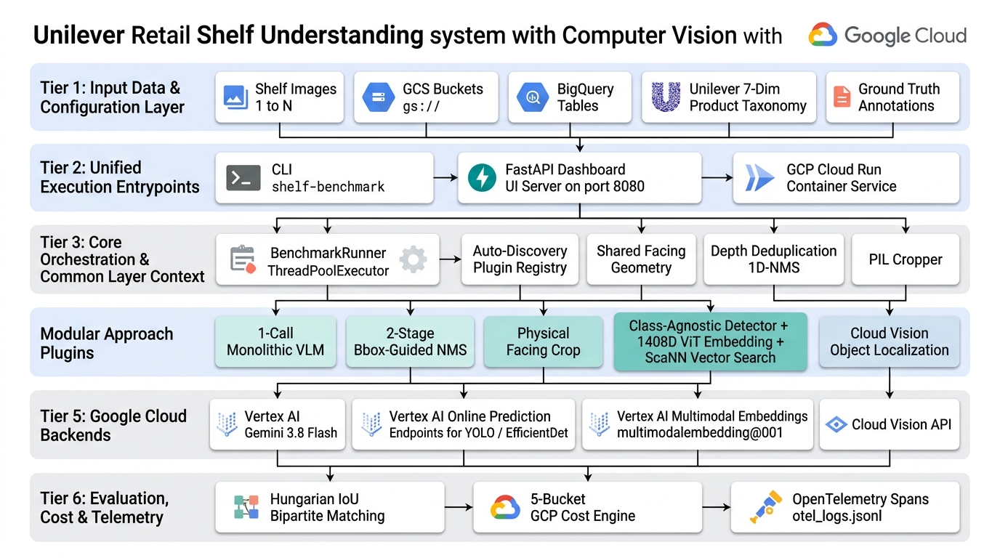
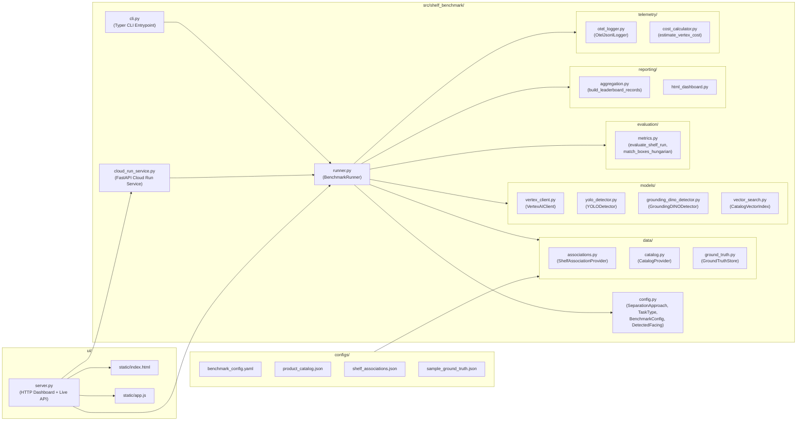

# Unilever Shelf Understanding with CV — System Architecture

This document provides the end-to-end architectural reference for the **Unilever
Retail Shelf Understanding & Benchmarking Platform**, covering its multi-image
(`1..N`) ingestion layer, the **8 distinct Computer Vision / VLM execution
paths**, the two-stage Ground Truth evaluation engine, OpenTelemetry cost/trace
instrumentation, and the interactive inspection UI.

---

## 1. High-Level End-to-End Platform Architecture

> [!TIP]
> **Editable Draw.io / Diagrams.net Source:**
> An editable vector model of this diagram is maintained in [`docs/architecture_diagram.drawio`](architecture_diagram.drawio).
> Open it directly in [draw.io / diagrams.net](https://app.diagrams.net) or the VS Code Draw.io extension to inspect or customize layers.

```mermaid
flowchart TB
    subgraph Inputs["1. Input Data & Configuration Layer (configs/)"]
        IMG["Shelf Images (1..N)<br/>Local PNG/JPG or gs:// Bucket URIs<br/>(configs/shelf_associations.json)"]
        CAT["Unilever Product Catalog<br/>7-Dim Taxonomy & Candidate SKUs<br/>(configs/product_catalog.json)"]
        GT["Ground Truth Annotations (Optional 1..N)<br/>Bounding Boxes + 7-Dim Attributes + SKUs<br/>(configs/sample_ground_truth.json)"]
        PROMPTS["Centralized Prompt & Schema Registry<br/>(src/shelf_benchmark/prompts/registry.py)"]
    end

    subgraph Entrypoints["2. Execution Entrypoints & Runtimes"]
        CLI["CLI Runner (shelf-benchmark)<br/>run | cloud-run | score | custom-demo"]
        UISERVER["Local Dashboard & Live Studio Server<br/>(ui/server.py :8080)<br/>GET /api/dashboard | GET /api/shelf-image | POST /api/run-live"]
        CLOUDRUN["Remote GCP Cloud Run Service<br/>(src/shelf_benchmark/cloud_run_service.py)<br/>POST /benchmark | POST /run-live"]
    end

    subgraph Core["3. Core Orchestration Engine (src/shelf_benchmark/runner.py)"]
        ASSOC["ShelfAssociationProvider<br/>Resolves 1..N Images & Candidate SKUs"]
        POOL["ThreadPoolExecutor (max_workers=N)<br/>Parallel (Image × Model × Approach) Dispatch"]
        ROUTER["SeparationApproach Router<br/>(_execute_inference)"]
    end

    subgraph Approaches["4. Eight CV / VLM Execution Paths"]
        P1["Path 1: monolithic_llm<br/>1-Pass Full-Shelf Detection + 7-Dim VLM"]
        P2["Path 2: two_stage_detection_first<br/>Stage 1 VLM Detector -> PIL Crop -> Stage 2 VLM Classifier"]
        P3["Path 3: hybrid_yolo_gemini<br/>YOLOv8n Local Proposals -> PIL Crop -> Gemini Classifier"]
        P4["Path 4: grounding_dino_gemini<br/>Zero-Shot Grounding DINO -> PIL Crop -> Gemini Classifier"]
        P5["Path 5: geap_end_to_end<br/>4-Agent GEAP Planner -> Detector -> Brand -> Critic"]
        P6["Path 6: embedding_vector_search<br/>Detector -> 1408-D Multimodal Embedding -> Cosine Top-K -> VLM"]
        P7["Path 7: ocr_augmented_vlm<br/>Detector -> Crop OCR Pre-Extraction -> Grounded 7-Dim VLM"]
        P8["Path 8: critic_verify_cascade<br/>Pass 1 Monolithic VLM -> Pass 2 Self-Correction Critic Audit"]
    end

    subgraph Models["5. Model & Vision Backends"]
        VERTEX["VertexAIClient (google-genai SDK)<br/>gemini-3.8-flash | gemini-3.5-flash-lite<br/>Structured JSON + 2-Pass Auto-Repair"]
        EMBED["Vertex AI Multimodal Embeddings<br/>(multimodalembedding@001) + CatalogVectorIndex"]
        LOCALCV["Local Open-Source Detectors<br/>Ultralytics YOLOv8n | HuggingFace Grounding DINO"]
    end

    subgraph EvalAndTel["6. Evaluation, Telemetry & Persistence Layer"]
        EVAL["Two-Stage Ground Truth Evaluator (metrics.py)<br/>Stage A: Hungarian O(n³) IoU Matching (AP@0.50, mAP@50:95, F1)<br/>Stage B: 7-Dim Attribute Macro Acc, Brand Acc, SKU Match Acc"]
        OTEL["OpenTelemetry & GCP Cost Calculator<br/>Token Usage, Latency Breakdown, Trace IDs<br/>(reports/otel_logs.jsonl)"]
        REPORTS["Structured Reports Store (reports/)<br/>benchmark_summary.json | row_level_report.json<br/>leaderboard.csv | crops/*.jpg"]
    end

    subgraph Frontend["7. Interactive Browser UI (ui/static/)"]
        OVERVIEW["Tab 1: Executive Overview & 16-Run Matrix<br/>Multi-Image (1..N) Filter & Approach Reference Cards"]
        INSPECTORS["Tabs 2-4: Use Case 1, 2 & 3 Visual Inspectors<br/>Interactive Canvas, GT Box Overlay, Crop Strip & 7-Dim Cards"]
        STUDIO["Tab 5: Live Execution Studio<br/>Real-Time Cloud Run / Local / Stub Trigger + Live Stepper"]
    end

    Inputs --> Entrypoints
    CLI --> Core
    UISERVER --> Core
    UISERVER <-->|"HTTP JSON Proxy"| CLOUDRUN
    CLOUDRUN --> Core
    Core --> ASSOC --> POOL --> ROUTER
    ROUTER --> P1 & P2 & P3 & P4 & P5 & P6 & P7 & P8
    P1 & P2 & P5 & P7 & P8 --> VERTEX
    P3 --> LOCALCV & VERTEX
    P4 --> LOCALCV & VERTEX
    P6 --> EMBED & VERTEX
    ROUTER --> EVAL
    GT --> EVAL
    EVAL --> REPORTS
    ROUTER --> OTEL --> REPORTS
    REPORTS --> UISERVER --> OVERVIEW & INSPECTORS & STUDIO
```

<!-- mdformat off(reason: preserving Mermaid architecture diagram) -->

<!-- mdformat on -->

---

## 2. Repository Module & Package Architecture

<!-- mdformat off(reason: preserving Mermaid package dependency diagram) -->

<!-- mdformat on -->

---

## 3. Core Architectural Principles

1. **Three Cumulative Retail Shelf Use Cases**:
   * **Use Case 1 — Object Detection (`object_detection`)**: Localize every
     front-row physical product facing on the shelf with normalized `[ymin,
     xmin, ymax, xmax]` coordinates (`0..1000` scale).
   * **Use Case 2 — Brand Classification (`brand_classification`)**: Identify
     the brand of every localized facing (supporting both `closed_taxonomy` and
     `open_vocabulary_generative` discovery).
   * **Use Case 3 — 7-Dimension Product Classification & SKU Matching
     (`classification`)**: Extract all 7 Unilever taxonomy attributes
     (`category`, `subcategory`, `brand`, `variant`, `packaging`, `pack_type`,
     `size`) and reconcile each facing against the candidate SKU catalog.

2. **Multi-Image (`1..N`) & Ground Truth Plug-and-Play Decoupling**:
   * Images are ingested via
     [`ShelfAssociationProvider`](file:///usr/local/google/home/rgavigan/unilever-shelf-understanding-with-cv/src/shelf_benchmark/data/associations.py)
     which maps `1..N` local files or `gs://` URIs to optional candidate SKUs
     and a `ground_truth_id`.
   * [`GroundTruthStore`](file:///usr/local/google/home/rgavigan/unilever-shelf-understanding-with-cv/src/shelf_benchmark/data/ground_truth.py)
     and
     [`evaluate_shelf_run`](file:///usr/local/google/home/rgavigan/unilever-shelf-understanding-with-cv/src/shelf_benchmark/evaluation/metrics.py)
     operate on standardized `DetectedFacing` outputs. Because inference and
     scoring are decoupled, any existing `reports/benchmark_summary.json` can be
     re-scored against newly delivered Ground Truth annotations in milliseconds
     via `shelf-benchmark score` without re-invoking Vertex AI.

3. **Zero-Drop Bounding Box Guarantee across Multi-Stage Pipelines**:
   * In all two-stage crop pipelines (`Path 2`, `Path 3`, `Path 4`, `Path 6`,
     `Path 7`), Stage 1 establishes the canonical shelf-space bounding box
     `[ymin, xmin, ymax, xmax]`, slices a high-resolution crop into
     `reports/crops/`, and passes that crop to Stage 2. Even if Stage 2 omits or
     returns `[0, 0, 0, 0]` for crop-local coordinates, the orchestrator
     preserves the Stage 1 shelf-space bounding box so every facing renders
     accurately on the shelf canvas.
