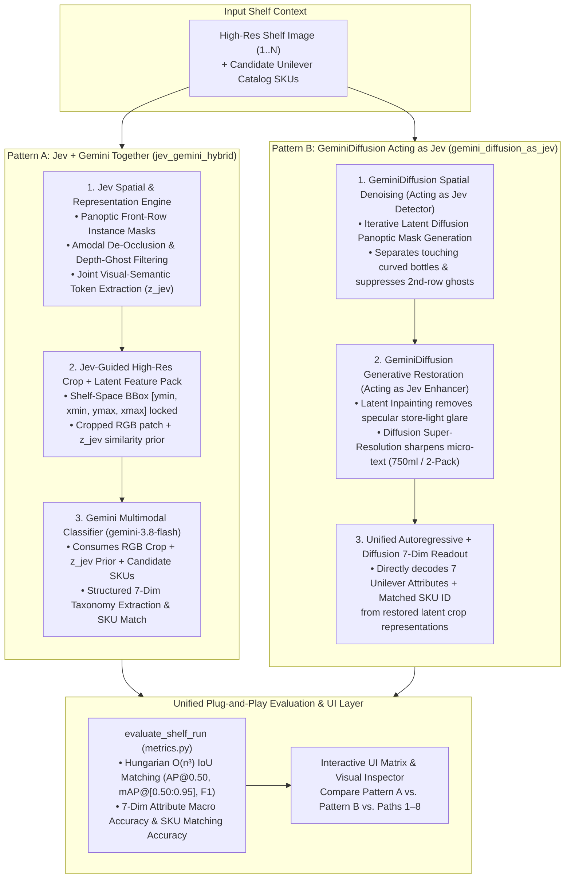
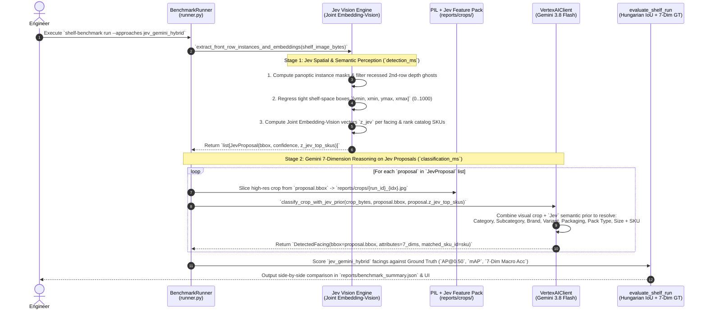
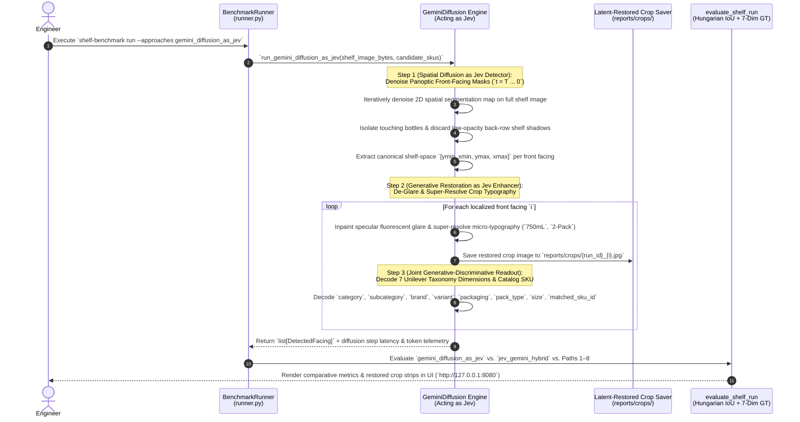
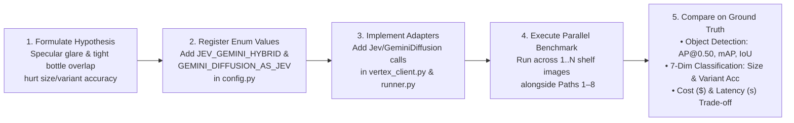

# Engineering Case Study: Solving Retail Shelf Understanding with `Jev + Gemini` vs. `GeminiDiffusion` Acting as `Jev`

> [!NOTE]
> This standalone architectural case study is **completely separate from the 8
> baseline production approaches (`Path 1` – `Path 8`)**. It illustrates how an
> engineer uses this repository's plug-and-play benchmarking framework to
> prototype, execute, and compare two advanced next-generation vision-language
> paradigms:
>
> 1. **Pattern A (`jev_gemini_hybrid`)**: Pairing **`Jev`** (Joint
>    Embedding-Vision spatial/representation specialist) **together with
>    `Gemini`** (`gemini-3.8-flash`).
> 2. **Pattern B (`gemini_diffusion_as_jev`)**: Using **`GeminiDiffusion` acting
>    directly as `Jev`** (unified diffusion-based spatial segmentation, latent
>    glare removal / super-resolution, and 7-Dimension taxonomy readout).

---

## 1. Why an Engineer Explores `Jev + Gemini` or `GeminiDiffusion-as-Jev`

On real-world retail shelves, baseline single-pass or standard 2-stage crop
pipelines encounter three physical optical bottlenecks:

1. **Specular Overhead Glare on Curved Bottles**: Fluorescent store lighting
   reflects off curved shampoo/body-wash bottles (`Dove 750ml`, `TRESemmé`),
   obscuring pack size (`750ml` vs `500ml`) and variant text.
2. **Tightly Packed Overlapping Facings & Depth Ghosts**: Cylindrical bottles
   touch edge-to-edge on crowded shelves while recessed 2nd-row stock (`depth
   ghosts`) peeks through gaps.
3. **Fine-Grained Visual-Semantic Disambiguation**: Distinguishing two nearly
   identical SKUs (e.g., *Dove Deep Moisture Body Wash 500ml* vs. *750ml Pump*)
   requires both sub-millimeter spatial boundary awareness and structured
   catalog reasoning.

---

## 2. Side-by-Side Architecture Diagram: `Jev + Gemini` vs. `GeminiDiffusion Acting as Jev`

<!-- mdformat off(reason: preserving Mermaid architecture comparison diagram) -->

<!-- mdformat on -->

---

## 3. Sequence Diagram 1: Engineer Uses `Jev` and `Gemini` Together (`jev_gemini_hybrid`)

In **Pattern A**, the engineer delegates all dense visual perception, panoptic
boundary separation, and joint embedding extraction to **`Jev`**, and passes
`Jev`'s locked shelf-space bounding boxes, de-glared crops, and top candidate
priors to **`Gemini`** for 7-Dimension structured reasoning.

<!-- mdformat off(reason: preserving Pattern A Jev + Gemini sequence diagram) -->

<!-- mdformat on -->

---

## 4. Sequence Diagram 2: `GeminiDiffusion` Acting Directly as `Jev` (`gemini_diffusion_as_jev`)

In **Pattern B**, the engineer replaces the external `Jev` module completely by
having **`GeminiDiffusion` act as `Jev`**. `GeminiDiffusion` performs iterative
denoising in latent space to segment overlapping bottles, reconstructs text
under specular shelf glare, and emits the 7-Dimension classification contract.

<!-- mdformat off(reason: preserving Pattern B GeminiDiffusion-as-Jev sequence diagram) -->

<!-- mdformat on -->

---

## 5. Engineer's End-to-End Experimentation Workflow Diagram

This diagram shows how the engineer takes the hypothesis (*"Does `Jev + Gemini`
or `GeminiDiffusion-as-Jev` beat our existing 8 approaches on occluded/glared
bottles?"*) and validates it in the repository:

<!-- mdformat off(reason: preserving Mermaid experimentation workflow diagram) -->

<!-- mdformat on -->

---

## 6. Trade-Off Matrix: `Jev + Gemini` vs. `GeminiDiffusion-as-Jev` vs. Baseline Paths

| Architectural Dimension | Baseline `Path 2` (`two_stage_detection_first`) | Pattern A: `Jev + Gemini` Together (`jev_gemini_hybrid`) | Pattern B: `GeminiDiffusion` Acting as `Jev` (`gemini_diffusion_as_jev`) |
| :--- | :--- | :--- | :--- |
| **Stage 1 Spatial Localization (`UC1`)** | Standard VLM bounding-box regression (`detect_only`) | **`Jev`** panoptic instance masks + amodal boundary separation | **`GeminiDiffusion`** iterative latent mask denoising |
| **Handling Specular Bottle Glare & Tiny Text** | Raw RGB crop passed directly to classifier | **`Jev`** joint visual-semantic embedding (`z_jev`) bridges missing pixels | **`GeminiDiffusion`** generative latent de-glaring & super-resolution |
| **Stage 2 7-Dimension Taxonomy & SKU (`UC2/UC3`)** | `Gemini` (`gemini-3.8-flash`) on raw RGB crop | **`Gemini`** conditioned on RGB crop + **`Jev`** top-$K$ semantic prior | **`GeminiDiffusion`** unified generative-discriminative readout |
| **Infrastructure Complexity** | 1 Model Family (`Gemini`) | 2 Models (`Jev` Vision Endpoint + `Gemini` VLM) | 1 Unified Model Family (`GeminiDiffusion` acting as both `Jev` & Classifier) |
| **Primary Strength** | Low latency, zero custom vision infra | High recall on ultra-dense shelves + fast `z_jev` vector pruning | Highest robustness on heavily glared, motion-blurred, or partially occluded labels |
