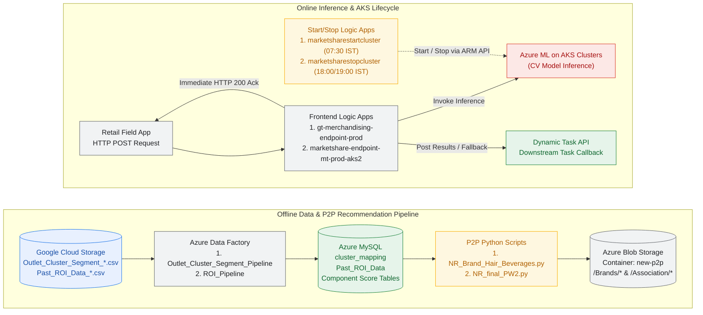
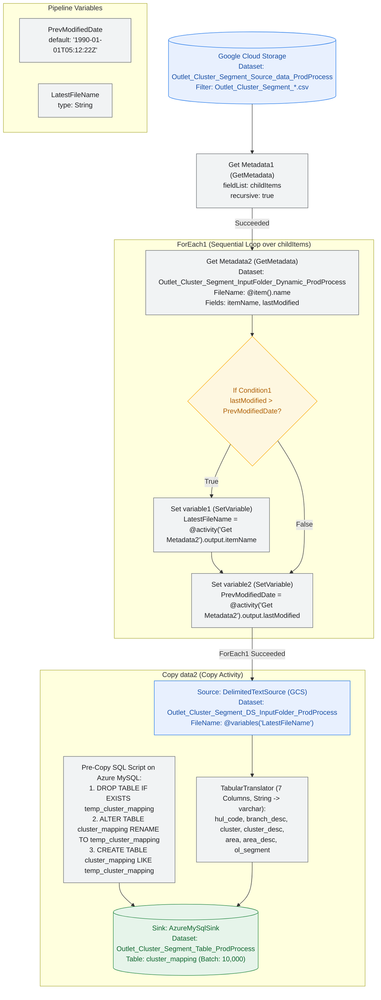
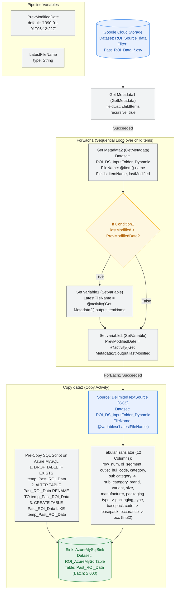
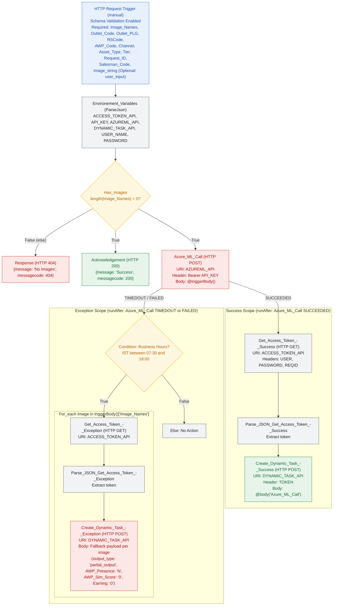
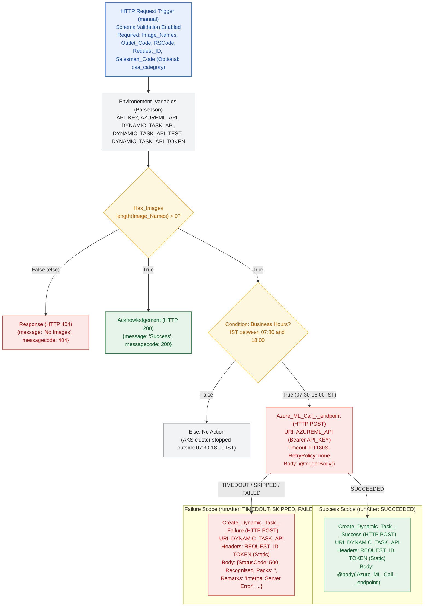
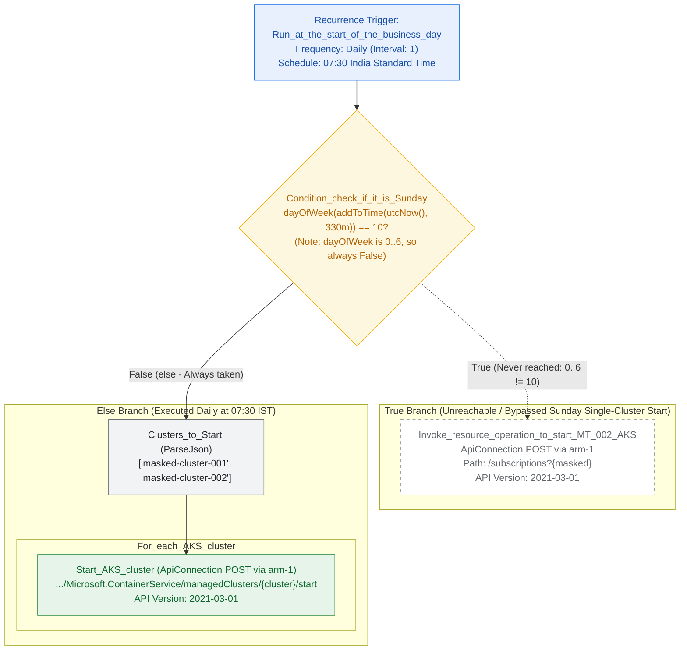
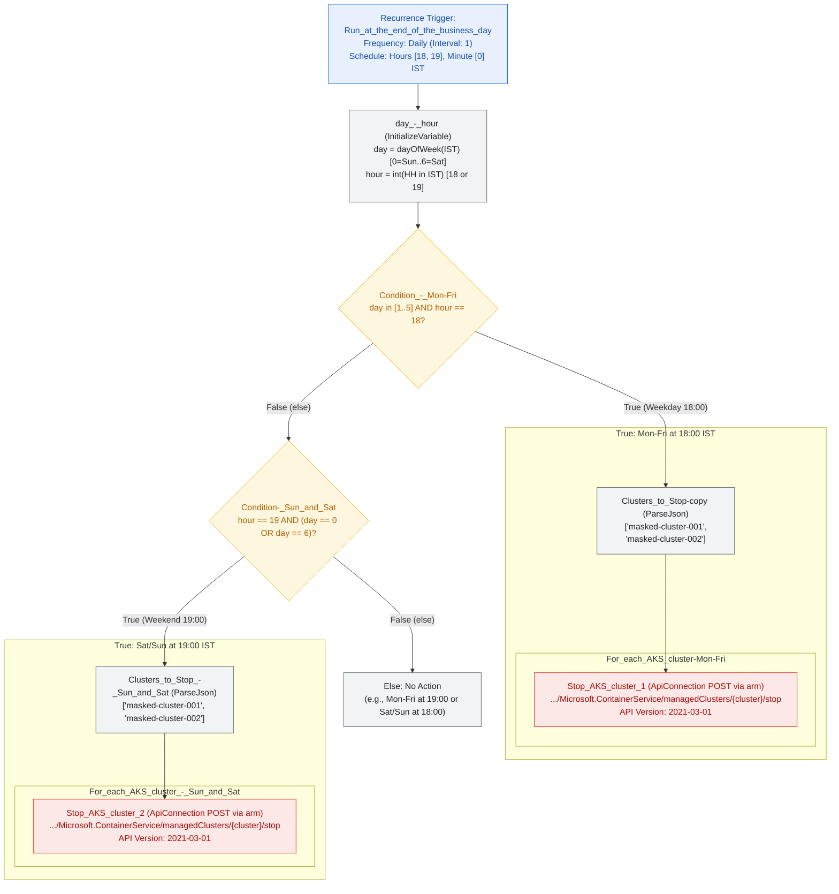
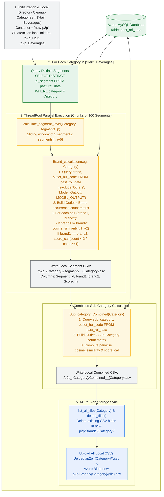
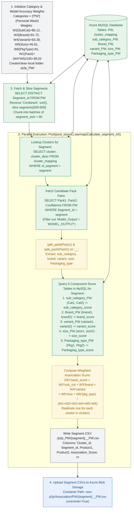

# Customer Input Code Analysis & Architecture Diagrams (Azure Cloud Platform)

*This document catalogs, visualizes, and explains the existing customer source code assets under [`docs/customer_code/`](customer_code/) deployed on Microsoft Azure (with cross-cloud data ingestion from Google Cloud Storage). Each file is accompanied by its corresponding Mermaid workflow diagram located under [`docs/diagrams/customer_inputs/`](diagrams/customer_inputs/) and a detailed technical breakdown.*

---

## Overview & Component Inventory

The customer's existing shelf-understanding and Path-to-Purchase (P2P) recommendation stack consists of **8 source files** organized into **4 functional groups**:

| Category | Source File | Mermaid Diagram | Primary Responsibility |
| :--- | :--- | :--- | :--- |
| **1. Azure Data Factory (ADF)** | [`Outlet_Cluster_Segment_Pipeline_ProdProcess.json`](customer_code/ADF/Outlet_Cluster_Segment_Pipeline_ProdProcess.json) | [`Outlet_Cluster_Segment_Pipeline_ProdProcess.mmd`](diagrams/customer_inputs/Outlet_Cluster_Segment_Pipeline_ProdProcess.mmd) | Finds the latest `Outlet_Cluster_Segment_*.csv` in GCS and loads it into Azure MySQL (`cluster_mapping`). |
| **1. Azure Data Factory (ADF)** | [`ROI_Pipeline.json`](customer_code/ADF/ROI_Pipeline.json) | [`ROI_Pipeline.mmd`](diagrams/customer_inputs/ROI_Pipeline.mmd) | Finds the latest `Past_ROI_Data_*.csv` in GCS and loads historical shelf ROI detections into Azure MySQL (`Past_ROI_Data`). |
| **2. ASP Frontend Logic Apps** | [`gt-merchandising-endpoint-prod.json`](customer_code/asp%20frontend%20logic%20apps/gt-merchandising-endpoint-prod.json) | [`gt-merchandising-endpoint-prod.mmd`](diagrams/customer_inputs/gt-merchandising-endpoint-prod.mmd) | HTTP ingestion endpoint for GT Merchandising; acknowledges requests, calls Azure ML, and posts results or per-image fallback tasks to Dynamic Task API. |
| **2. ASP Frontend Logic Apps** | [`marketshare-endpoint-mt-prod-aks2.json`](customer_code/asp%20frontend%20logic%20apps/marketshare-endpoint-mt-prod-aks2.json) | [`marketshare-endpoint-mt-prod-aks2.mmd`](diagrams/customer_inputs/marketshare-endpoint-mt-prod-aks2.mmd) | HTTP ingestion endpoint for MT MarketShare; enforces `07:30–18:00 IST` window before calling Azure ML (`PT180S` timeout) and callbacks to Dynamic Task API. |
| **3. ASP Start/Stop Logic Apps** | [`marketsharestartcluster.json`](customer_code/asp%20startstop%20logic%20apps/marketsharestartcluster.json) | [`marketsharestartcluster.mmd`](diagrams/customer_inputs/marketsharestartcluster.mmd) | Scheduled Logic App (`07:30 IST` daily) that starts the MarketShare AKS clusters via Azure Resource Manager (ARM). |
| **3. ASP Start/Stop Logic Apps** | [`marketsharestopcluster.json`](customer_code/asp%20startstop%20logic%20apps/marketsharestopcluster.json) | [`marketsharestopcluster.mmd`](diagrams/customer_inputs/marketsharestopcluster.mmd) | Scheduled Logic App that stops AKS clusters at `18:00 IST` on weekdays (`Mon–Fri`) and `19:00 IST` on weekends (`Sat–Sun`). |
| **4. P2P Python Scripts** | [`NR_Brand_Hair_Beverages.py`](customer_code/p2p/NR_Brand_Hair_Beverages.py) | [`NR_Brand_Hair_Beverages.mmd`](diagrams/customer_inputs/NR_Brand_Hair_Beverages.mmd) | Computes segment-level brand cosine similarity and combined sub-category similarity from `past_roi_data` in MySQL and uploads CSVs to Azure Blob Storage. |
| **4. P2P Python Scripts** | [`NR_final_PW2.py`](customer_code/p2p/NR_final_PW2.py) | [`NR_final_PW2.mmd`](diagrams/customer_inputs/NR_final_PW2.mmd) | Combines 5 component similarity tables (`sub_category`, `Brand`, `variant`, `size`, `Packaging_type`) with model accuracy weights (`W1–W6`) into final cluster-level `Association_Score` CSVs on Azure Blob Storage. |

### End-to-End Customer System Interaction



---

## 1. Azure Data Factory (ADF) Pipelines

Both ADF pipelines follow a standardized pattern to ingest the most recently modified CSV file from **Google Cloud Storage (GCS)** into **Azure Database for MySQL**, rotating the existing target table into a `temp_*` backup table prior to ingestion.

---

### 1.1 `Outlet_Cluster_Segment_Pipeline_ProdProcess.json`

* **Source File:** [`docs/customer_code/ADF/Outlet_Cluster_Segment_Pipeline_ProdProcess.json`](customer_code/ADF/Outlet_Cluster_Segment_Pipeline_ProdProcess.json)
* **Mermaid Source:** [`docs/diagrams/customer_inputs/Outlet_Cluster_Segment_Pipeline_ProdProcess.mmd`](diagrams/customer_inputs/Outlet_Cluster_Segment_Pipeline_ProdProcess.mmd)



#### Detailed Explanation
1. **Purpose:** Synchronizes the outlet-to-cluster-and-segment hierarchy (`cluster_mapping` table in Azure MySQL) from the latest `Outlet_Cluster_Segment_*.csv` export stored in Google Cloud Storage. This mapping is consumed downstream by [`NR_final_PW2.py`](customer_code/p2p/NR_final_PW2.py) to associate segment-level product recommendations with geographic/operational clusters.
2. **Pipeline Variables:**
   * `PrevModifiedDate`: Initialized to `"1990-01-01T05:12:22Z"` for timestamp comparison.
   * `LatestFileName`: Holds the filename of the newest CSV discovered during metadata iteration.
3. **Execution Flow:**
   * **`Get Metadata1` (`GetMetadata`):** Queries GCS dataset `Outlet_Cluster_Segment_Source_data_ProdProcess` with wildcard filter `Outlet_Cluster_Segment_*.csv` (`recursive: true`) to retrieve `childItems`.
   * **`ForEach1` (`ForEach`, `isSequential: true`):** Iterates over each file in `childItems`:
     * **`Get Metadata2`:** Fetches `itemName` and `lastModified` for `@item().name`.
     * **`If Condition1`:** Evaluates `@greater(formatDateTime(activity('Get Metadata2').output.lastModified,'yyyyMMddHHmmss'), formatDateTime(variables('PrevModifiedDate'),'yyyyMMddHHmmss'))`. When true, **`Set variable1`** sets `LatestFileName` to `@activity('Get Metadata2').output.itemName`.
     * **`Set variable2`:** Sets `PrevModifiedDate` to `@activity('Get Metadata2').output.lastModified`. *(Implementation note: Because `Set variable2` is placed outside `ifTrueActivities` as a successor to `If Condition1`, `PrevModifiedDate` is overwritten on every iteration rather than strictly inside the `True` branch, assuming `childItems` are listed in chronological order.)*
   * **`Copy data2` (`Copy`):**
     * **Pre-Copy SQL Rotation:** Atomically rotates the current `cluster_mapping` table to `temp_cluster_mapping` and creates a fresh `cluster_mapping` table with identical schema:
       ```sql
       drop table if exists temp_cluster_mapping;
       alter table cluster_mapping rename to temp_cluster_mapping;
       create table cluster_mapping like temp_cluster_mapping;
       ```
     * **Column Mapping (`TabularTranslator`, `writeBatchSize: 10000`):** Maps 7 `String` CSV columns (`hul_code`, `branch_desc`, `cluster`, `cluster_desc`, `area`, `area_desc`, `ol_segment`) to `varchar` columns in Azure MySQL.

---

### 1.2 `ROI_Pipeline.json`

* **Source File:** [`docs/customer_code/ADF/ROI_Pipeline.json`](customer_code/ADF/ROI_Pipeline.json)
* **Mermaid Source:** [`docs/diagrams/customer_inputs/ROI_Pipeline.mmd`](diagrams/customer_inputs/ROI_Pipeline.mmd)



#### Detailed Explanation
1. **Purpose:** Ingests historical Region-of-Interest (ROI) shelf detection records (`Past_ROI_Data_*.csv`) from Google Cloud Storage into the `Past_ROI_Data` table in Azure MySQL. This table serves as the primary input to [`NR_Brand_Hair_Beverages.py`](customer_code/p2p/NR_Brand_Hair_Beverages.py) for calculating brand and sub-category co-occurrence scores across outlets.
2. **Execution Flow:**
   * Uses the same `Get Metadata1` -> sequential `ForEach1` (`Get Metadata2` -> `If Condition1` -> `Set variable1` -> `Set variable2`) pattern to identify the newest `Past_ROI_Data_*.csv` file in GCS.
   * **`Copy data2` (`Copy`, `writeBatchSize: 2000`):**
     * **Pre-Copy SQL Rotation:** Rotates `Past_ROI_Data` to `temp_Past_ROI_Data` and recreates an empty `Past_ROI_Data` table.
     * **Column Mapping (`TabularTranslator`):** Maps and normalizes 12 columns from the source CSV into MySQL:

| CSV Source Column | Source Type | MySQL Sink Column | Sink Physical Type |
| :--- | :--- | :--- | :--- |
| `row_num` | `String` | `row_num` | `varchar` |
| `ol_segment` | `String` | `ol_segment` | `varchar` |
| `outlet_hul_code` | `String` | `outlet_hul_code` | `varchar` |
| `category` | `String` | `category` | `varchar` |
| `sub category` | `String` | `sub_category` | `varchar` |
| `brand` | `String` | `brand` | `varchar` |
| `variant` | `String` | `variant` | `varchar` |
| `size` | `String` | `size` | `varchar` |
| `manufacturer` | `String` | `manufacturer` | `varchar` |
| `packaging type` | `String` | `packaging_type` | `varchar` |
| `basepack code` | `String` | `basepack` | `varchar` |
| `occurance` | `String` | `occ` | `int` (`Int32`) |

---

## 2. ASP Frontend Logic Apps

The ASP Frontend Logic Apps act as stateful HTTP orchestration gateways between retail execution client applications and the backend Azure ML computer vision endpoints hosted on AKS. Both workflows use an **asynchronous callback pattern**: as soon as a valid request with images arrives, the Logic App returns `HTTP 200` to the caller while continuing in the background to invoke Azure ML and push the resulting payload to `DYNAMIC_TASK_API`.

---

### 2.1 `gt-merchandising-endpoint-prod.json`

* **Source File:** [`docs/customer_code/asp frontend logic apps/gt-merchandising-endpoint-prod.json`](customer_code/asp%20frontend%20logic%20apps/gt-merchandising-endpoint-prod.json)
* **Mermaid Source:** [`docs/diagrams/customer_inputs/gt-merchandising-endpoint-prod.mmd`](diagrams/customer_inputs/gt-merchandising-endpoint-prod.mmd)



#### Detailed Explanation
1. **Trigger & Input Validation (`manual` Request Trigger):**
   * Enforces JSON schema validation (`EnableSchemaValidation`) requiring 11 properties: `Image_Names` (array of strings), `Outlet_Code`, `Outlet_PLG`, `RSCode`, `AWP_Code`, `Channel`, `Asset_Type`, `Tier`, `Request_ID` (`minLength: 1`), `Salesman_Code`, and `image_string`, plus optional `user_input`.
2. **Environment Configuration (`Environement_Variables`):**
   * Uses a `ParseJson` action to expose endpoint URIs and credentials (`ACCESS_TOKEN_API`, `API_KEY`, `AZUREML_API`, `DYNAMIC_TASK_API`, `USER_NAME`, `PASSWORD`).
3. **Image Presence Check & Asynchronous Acknowledgement (`Has_Images`):**
   * Checks `@greater(length(triggerBody()['Image_Names']), 0)`.
   * **If `False` (`else`):** Immediately returns HTTP `404` (`{"message": "No Images", "messagecode": 404}`).
   * **If `True`:** Simultaneously returns HTTP `200` (`Acknowledgement`) to the caller and dispatches an HTTP `POST` (`Azure_ML_Call`) with the full `@triggerBody()` to `AZUREML_API`.
4. **Success Path (`Success` Scope — runs when `Azure_ML_Call` `SUCCEEDED`):**
   * Calls `ACCESS_TOKEN_API` (`GET` with `USER`, `PASSWORD`, `REQID` headers) to obtain a dynamic bearer token, parses the token JSON, and `POST`s the raw `Azure_ML_Call` response body to `DYNAMIC_TASK_API`.
5. **Exception Path (`Exception` Scope — runs when `Azure_ML_Call` `TIMEDOUT` or `FAILED`):**
   * Checks whether current India Standard Time (`IST`) is between `07:30` and `18:00`.
   * If within business hours, iterates (`For_each`) over every image in `triggerBody()['Image_Names']`, fetches an access token per image, and posts a degraded/fallback merchandising record (`output_type: "partial_output"`, `AWP_Presence: "N"`, `AWP_Sim_Score: "0"`, `Envision_Sim_Score: "0"`, `Earning: "0"`) to `DYNAMIC_TASK_API`.

---

### 2.2 `marketshare-endpoint-mt-prod-aks2.json`

* **Source File:** [`docs/customer_code/asp frontend logic apps/marketshare-endpoint-mt-prod-aks2.json`](customer_code/asp%20frontend%20logic%20apps/marketshare-endpoint-mt-prod-aks2.json)
* **Mermaid Source:** [`docs/diagrams/customer_inputs/marketshare-endpoint-mt-prod-aks2.mmd`](diagrams/customer_inputs/marketshare-endpoint-mt-prod-aks2.mmd)



#### Detailed Explanation
1. **Trigger & Input Validation (`manual` Request Trigger):**
   * Validates required fields `Image_Names`, `Outlet_Code`, `RSCode`, `Request_ID`, `Salesman_Code`, and optional `psa_category`.
2. **Key Architectural Differences vs. GT Merchandising (`gt-merchandising-endpoint-prod.json`):**
   * **Upfront Business-Hours Gate (`07:30–18:00 IST`):** Unlike GT Merchandising (which always calls Azure ML and only checks business hours in the exception handler), MT MarketShare checks whether current IST is between `07:30` and `18:00` **before** invoking `Azure_ML_Call_-_endpoint`. Requests arriving outside `07:30–18:00 IST` receive HTTP `200` (`Acknowledgement`) but are silently dropped because the underlying AKS clusters are stopped overnight.
   * **Explicit Timeout & Retry Configuration:** `Azure_ML_Call_-_endpoint` sets `timeout: "PT180S"` (3 minutes) and `retryPolicy: {"type": "none"}`.
   * **Static Token Authentication:** Uses a pre-configured `DYNAMIC_TASK_API_TOKEN` from `Environement_Variables` rather than making a separate `GET` call to `ACCESS_TOKEN_API` on every request.
   * **Single Failure Callback:** On `TIMEDOUT`, `SKIPPED`, or `FAILED`, posts a single request-level failure payload (`StatusCode: 500`, `Remarks: "Internal Server Error"`, `Recognised_Packs: ""`) to `DYNAMIC_TASK_API` rather than looping over individual images.

---

## 3. ASP Start/Stop Logic Apps

To control Azure compute expenditure, two recurrence-triggered Logic Apps manage the daily power state (`start` / `stop`) of the Azure Kubernetes Service (`Microsoft.ContainerService/managedClusters`) clusters hosting the CV models.

---

### 3.1 `marketsharestartcluster.json`

* **Source File:** [`docs/customer_code/asp startstop logic apps/marketsharestartcluster.json`](customer_code/asp%20startstop%20logic%20apps/marketsharestartcluster.json)
* **Mermaid Source:** [`docs/diagrams/customer_inputs/marketsharestartcluster.mmd`](diagrams/customer_inputs/marketsharestartcluster.mmd)



#### Detailed Explanation
1. **Schedule (`Run_at_the_start_of_the_business_day`):** Fires daily at **07:30 IST** (`hours: ["7"]`, `minutes: [30]`, `India Standard Time`), matching the `07:30` opening window in the frontend Logic Apps.
2. **Sunday Check Condition (`Condition_check_if_it_is_Sunday`):**
   * Evaluates `@equals(dayOfWeek(formatDateTime(addToTime(utcNow(),330,'Minute'),'yyyy-MM-dd')), 10)`.
   * **Implementation Nuance:** In Azure Logic Apps Workflow Definition Language, `dayOfWeek()` returns an integer from `0` (Sunday) to `6` (Saturday). Comparing `dayOfWeek(...)` to `10` intentionally (or inadvertently) forces the condition to evaluate to `False` on every day of the week—effectively bypassing the single-cluster Sunday start (`Invoke_resource_operation_to_start_MT_002_AKS`) and always executing the `else` branch.
3. **Cluster Startup (`Else` Branch):**
   * Parses the cluster array `["masked-cluster-001", "masked-cluster-002"]` (`Clusters_to_Start`).
   * Loops through each cluster in `For_each_AKS_cluster` and invokes the Azure Resource Manager (`arm-1`) `POST` operation `/subscriptions/<sub-id>/resourcegroups/<rg>/providers/Microsoft.ContainerService/managedClusters/<cluster>/start?x-ms-api-version=2021-03-01`.

---

### 3.2 `marketsharestopcluster.json`

* **Source File:** [`docs/customer_code/asp startstop logic apps/marketsharestopcluster.json`](customer_code/asp%20startstop%20logic%20apps/marketsharestopcluster.json)
* **Mermaid Source:** [`docs/diagrams/customer_inputs/marketsharestopcluster.mmd`](diagrams/customer_inputs/marketsharestopcluster.mmd)



#### Detailed Explanation
1. **Schedule (`Run_at_the_end_of_the_business_day`):** Triggers twice daily at **18:00 IST** and **19:00 IST** (`hours: [18, 19]`, `minutes: [0]`).
2. **Variable Initialization (`day_-_hour`):** Computes `day` (`dayOfWeek` in IST: `0`=Sunday, `1..5`=Mon–Fri, `6`=Saturday) and `hour` (`18` or `19`).
3. **Weekday Shutdown (`Condition_-_Mon-Fri`):**
   * When `day >= 1 AND day <= 5 AND hour == 18`, iterates over `["masked-cluster-001", "masked-cluster-002"]` and calls the ARM `stop` endpoint (`managedClusters/<cluster>/stop`).
4. **Weekend Shutdown (`Condition-_Sun_and_Sat`):**
   * When `hour == 19 AND (day == 0 OR day == 6)`, iterates over the two AKS clusters and stops them one hour later (at **19:00 IST**) on Saturdays and Sundays.
   * On the off-hour triggers (19:00 on weekdays or 18:00 on weekends), neither condition matches and the workflow exits with no action.

---

## 4. Path-to-Purchase (P2P) Python Scripts

The `docs/customer_code/p2p/` scripts implement the offline recommendation scoring engine that computes product-to-product and brand-to-brand association scores per outlet segment (`ol_segment`) and cluster (`cluster_id`).

---

### 4.1 `NR_Brand_Hair_Beverages.py`

* **Source File:** [`docs/customer_code/p2p/NR_Brand_Hair_Beverages.py`](customer_code/p2p/NR_Brand_Hair_Beverages.py)
* **Mermaid Source:** [`docs/diagrams/customer_inputs/NR_Brand_Hair_Beverages.mmd`](diagrams/customer_inputs/NR_Brand_Hair_Beverages.mmd)



#### Detailed Explanation
1. **Purpose:** Calculates pairwise brand similarity scores per segment (`ol_segment`) and combined sub-category similarity scores for the `Hair` and `Beverages` categories from historical shelf detection data (`past_roi_data` in Azure MySQL, populated by [`ROI_Pipeline.json`](#12-roi_pipelinejson)), then syncs the generated CSV files to Azure Blob Storage (`new-p2p/Brands/<Category>/`).
2. **Core Mathematical Functions:**
   * **Cross-Entity Similarity ([`cosine_similarity(v1, v2)`](customer_code/p2p/NR_Brand_Hair_Beverages.py#L40-L48)):** When `brand1 != brand2`, computes the cosine similarity between their outlet occurrence vectors $v_1$ and $v_2$ across all outlets in the segment:
     $$\text{CosineSimilarity}(v_1, v_2) = \frac{\sum_i v_{1,i} \cdot v_{2,i}}{\sqrt{\sum_i v_{1,i}^2 \cdot \sum_i v_{2,i}^2}}$$
   * **Self-Association / Repeat Presence ([`score_cal(lis)`](customer_code/p2p/NR_Brand_Hair_Beverages.py#L26-L38)):** When `brand1 == brand2`, computes the fraction of outlets carrying the brand that have at least 2 detections/facings:
     $$\text{Score}_{\text{self}} = \frac{\text{Outlets with count} \ge 2}{\text{Outlets with count} \ge 1}$$
3. **Execution Steps:**
   * **Step 1 (Local Folder Setup):** Creates or empties `./p2p_Hair/` and `./p2p_Beverages/`.
   * **Step 2 (Segment Discovery):** Queries `SELECT DISTINCT ol_segment FROM past_roi_data WHERE category = '<Category>'`.
   * **Step 3 (Parallel Segment-Level Brand Calculation):**
     * Uses `multiprocessing.pool.ThreadPool` (`pool_size = int(len(segments)/100)`) to process chunks of 100 segments concurrently via [`calculate_segment_level`](customer_code/p2p/NR_Brand_Hair_Beverages.py#L263-L286).
     * Inside [`calculate_segment_level`](customer_code/p2p/NR_Brand_Hair_Beverages.py#L268-L285), iterates over `segments` using a 5-element slice `segments[segment:segment+5]`, calls [`Brand_calculation(seg, Category)`](customer_code/p2p/NR_Brand_Hair_Beverages.py#L78-L154) (filtering out `sub_category` values `'Others'`, `'Model_Output'`, `'MODEL_OUTPUT'`), and writes `./p2p_<Category>/<segment>__<Category>.csv`.
   * **Step 4 (Combined Sub-Category Calculation):** Calls [`Sub_category_Combined(Category)`](customer_code/p2p/NR_Brand_Hair_Beverages.py#L157-L234) across all segments (`Segment_id = "Combined"`) at the `sub_category` level and writes `./p2p_<Category>/Combined__<Category>.csv`.
   * **Step 5 (Azure Blob Storage Cleanup & Upload):** Deletes all existing blobs under `new-p2p/Brands/<Category>/` via [`list_all_files`](customer_code/p2p/NR_Brand_Hair_Beverages.py#L50-L64) and [`delete_files`](customer_code/p2p/NR_Brand_Hair_Beverages.py#L66-L74), then uploads all newly generated `.csv` files from `./p2p_<Category>/`.

---

### 4.2 `NR_final_PW2.py`

* **Source File:** [`docs/customer_code/p2p/NR_final_PW2.py`](customer_code/p2p/NR_final_PW2.py)
* **Mermaid Source:** [`docs/diagrams/customer_inputs/NR_final_PW2.mmd`](diagrams/customer_inputs/NR_final_PW2.mmd)



#### Detailed Explanation
1. **Purpose:** Computes the final **weighted product-pair Association Score** for Personal Wash (`Categories = ["PW"]`, segments `300:600`) by blending 6 hierarchical similarity levels—Pack Confidence (`W1`), Sub-Category (`W2`), Brand (`W3`), Variant (`W4`), Size (`W5`), and Packaging Type (`W6`)—weighted by the CV model accuracies for each hierarchy level.
2. **Model Accuracy Weighting Table (`Accuracies`):**
   The script defines empirically measured CV model accuracies across 10 product categories, computing $W_1 = \frac{W_4 \times W_5}{100}$:

| Category | $W_1$ (Pack = $\frac{W_4 \cdot W_5}{100}$) | $W_2$ (Sub-Category) | $W_3$ (Brand) | $W_4$ (Variant) | $W_5$ (Size) | $W_6$ (Packaging Type) |
| :--- | :---: | :---: | :---: | :---: | :---: | :---: |
| **PW (Active)** | **38.03** | **86.12** | **91.72** | **83.38** | **45.61** | **81.00** |
| `Foods` | *70.55* | 86.00 | 85.00 | 83.00 | 85.00 | 78.00 |
| `Beverages` | *54.00* | 84.00 | 85.00 | 75.00 | 72.00 | 75.00 |
| `HFD` | *43.32* | 92.00 | 94.00 | 76.00 | 57.00 | 91.00 |
| `HHC` | *62.90* | 87.00 | 88.00 | 85.00 | 74.00 | 84.00 |
| `Hair` | *56.51* | 84.55 | 92.77 | 73.02 | 77.39 | 84.00 |
| `DMT` | *58.13* | 90.67 | 90.90 | 80.58 | 72.14 | 84.00 |
| `Skin` | *54.58* | 74.51 | 84.83 | 79.14 | 68.97 | 65.00 |
| `Oral_Care` | *31.85* | 75.03 | 78.79 | 68.86 | 46.25 | 80.00 |
| `Laundry` | *35.59* | 72.57 | 77.45 | 57.40 | 62.00 | 84.00 |

3. **Execution Flow ([`Calculate_segment_AS`](customer_code/p2p/NR_final_PW2.py#L85-L180)):**
   * **Segment Selection & Batching:** Queries `SELECT DISTINCT Segment_id FROM PW`, removes `"Combined"`, sorts the list, slices `segments[300:600]`, and distributes batches of `segment_size = 80` across a `ThreadPool` using `p.starmap(Calculate_segment_AS, arguemnts)`.
   * **Cluster Mapping Lookup:** Queries `SELECT cluster, cluster_desc FROM cluster_mapping WHERE ol_segment = '<segment>'` (populated by [`Outlet_Cluster_Segment_Pipeline_ProdProcess.json`](#11-outlet_cluster_segment_pipeline_prodprocessjson)).
   * **Pack Decomposition ([`split_pack`](customer_code/p2p/NR_final_PW2.py#L78-L81)):** For each candidate row `(Pack1, Pack2, Confidence)` in table `PW` (excluding rows containing `Model_Output` / `MODEL_OUTPUT`), splits the `__`-delimited pack identifier into 5 attributes:
     `[category_prefix, sub_category, brand, variant, size, Packaging_type]`.
   * **Component Score Lookups & Weighted Formula:** Queries 5 pre-computed similarity tables in MySQL (`sub_category_PW`, `Brand_PW`, `variant_PW`, `size_PW`, `Packaging_type_PW`) for the segment and attribute pairs, defaulting missing scores to `0`, and calculates:
     $$\text{Association\_Score} = \frac{W_1 \cdot S_{\text{pack}} + W_2 \cdot S_{\text{subcat}} + W_3 \cdot S_{\text{brand}} + W_4 \cdot S_{\text{variant}} + W_5 \cdot S_{\text{size}} + W_6 \cdot S_{\text{pkg}}}{\sum_{k=1}^{6} W_k}$$
   * **Output Generation & Upload:** Writes `./p2p_PW/<segment>__PW.csv` with one row per associated `Cluster_id` and uploads all CSV files to Azure Blob Storage under `new-p2p/Association/PW/<segment>__PW.csv`.
