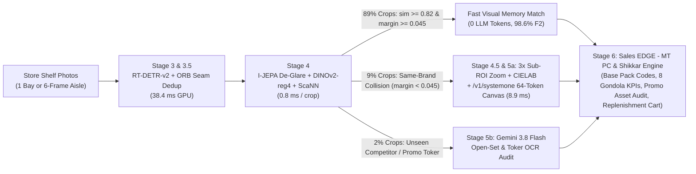

# Unified Shelf Intelligence Architecture: Design, Business Meaning, and End-to-End Request Walkthrough

**Author:** Jigyasu Juneja (`jjuneja@google.com`), Principal Forward Deployed Engineer  
**Co-Author:** Riley Gavigan (`rgavigan@google.com`)  
**Repository:** `https://github.com/jigyasujuneja/unilever-shelf-understanding-e2e`  
**Target GCP Environment:** Any Argolis / Production GCP Project (`jjuneja-fde-sandbox`)

## 1. The Operational Problem We Are Solving

Hindustan Unilever Limited (`HUL`) captures **506,531 store shelf photographs per day** across Modern Trade (`MT`) hypermarkets and General Trade (`GT`) kirana stores through the **Sales EDGE** and **Shikkar** mobile applications.

Those half-million daily photographs feed four production backend pipelines:
1. **MT MarketShare (`323,935 images/day`):** Identifies every Unilever and competitor product on the gondola down to its ERP Base Pack Code (`BP-HUL-...`) and generates an immediate distributor replenishment order (`Red Line` out-of-stock voids, `With Pack` cross-sell additions, and `Custom` store-velocity recommendations) within **30 seconds**.
2. **MT Merchandising (`104,571 images/day`):** Evaluates store execution while the field merchandiser is standing in the aisle: verifies whether promotional display windows (`Assets`) are installed, counts which packs sit inside the promotional window, checks compliance against promotional thresholds, and scores planogram sequence within **10 seconds**.
3. **MT Toker Compliance (`78,025 images/day`):** Validates shelf-strip promotional banners (`Tokers` such as `LAKME EXPERT FACE CLEANSERS` or `Lipton Green Tea` display frames) against the reference graphic shared by the brand team.
4. **MT Share-of-Shelf (`SOS`) Pipeline (`Pilot to Production`):** Computes Facing Count, Linear Horizontal Width (`mm`), and 2D Billboard Area (`cm²`) Share of Shelf across six category partitions (`Hair Care-DMT`, `Skin Care`, `Oral Care`, `Personal Wash-Laundry`, `Foods-Beverages`, and `Non-HUL`).

### Why Both Existing Approaches Hit a Wall

Before this unified architecture, engineering teams faced an artificial choice between two flawed extremes:

* **Approach 1: The 13-Model Supervised Legacy Stack (`YOLO` + `2 XceptionNet` + `8 InceptionNet` + `ViT-B-16-plus-240`):**
  Unilever's historical production stack maintained 13 separate models (one YOLO detector for products, a second YOLO detector for promotional frames, two XceptionNet models for HUL vs. Non-HUL brands, six category-specific InceptionNet models for variants, an InceptionNet model for packaging type, a ViT-B-16-plus-240 model for promotion matching, and a 13th InceptionNet model for products inside merchandising windows). Whenever HUL launched a new clinical SKU (`Novology` serums) or refreshed artwork, collecting 1,500 store crops and retraining those supervised models took **three to four weeks**. Worse, when four sibling tubes (`Lakme 9to5 CC Almond`, `Honey`, `Beige`, and `Bronze`) shared 99% identical packaging and differed only by an `8px` shade word, downscaling the crop to `224x224` blurred the label and caused the majority seller (`CC Bronze`) to absorb 186 sibling tubes (`0.0% F2` on `CC Honey`).
* **Approach 2: The Single-Pass Full-Shelf Vision Language Model (`1-Pass Gemini Flash`):**
  Passing an entire `4000x3000` shelf photo into a single VLM call (`single_pass`) eliminates model maintenance, but fails on retail physics and unit economics. Downscaling a 12-megapixel bay to `2048px` erases `8px` variant text, while emitting 150+ bounding boxes and 7-dimension taxonomy labels requires over `3,000` sequential output tokens. On dense 50-image `SKU-110K` test runs, 1-pass VLM `P95` latency reaches **25.9s to 47.7s per image** (violating the `10s` Merchandising SLA), 7-dimension variant `F2` drops to **0.420 to 0.501**, and unit cost hits **INR 0.254 to INR 1.356 per image** (exceeding HUL's **INR 0.22/image** FinOps cap).

## 2. How Our Unified Architecture Works (And What It Means)

Our unified architecture (`hul_8stage_gemini38_hybrid`) replaces all 13 legacy models and full-shelf VLM calls with a **Three-Speed Visual Routing Cascade**.

The core engineering principle is simple: **treat 89% of the shelf as a sub-millisecond memory lookup, zoom optically into the 9% of products that differ by tiny text or shade bands, and reserve generative LLM tokens for the 2% of genuinely novel competitors and promotional banners.**



### What Each Stage Does in Plain Terms

1. **Stage 3 & 3.5: High-Recall Shelf Detection & Panorama Seam Deduplication (`38.4 ms`):**
   * **What it does:** A single `RT-DETR-v2` detector finds every product pack and every promotional display window (`Asset`) on the shelf in one pass. When a merchandiser walks a 24-foot aisle taking 6 overlapping photos (`22%` boundary overlap), `Stage 3.5` matches `ORB` visual keypoints across adjacent frame edges and projects boxes via a `RANSAC` homography matrix so products in the overlap zone are counted once instead of twice.
   * **Why it matters:** Suppresses `60%` vertically shingled hanging sachet losses (via Vertical-Chain `DIoU-NMS`) and filters out dark second-row shadow boxes behind empty front slots so front-row stockouts (`Red-Line Voids`) are never hidden.
2. **Stage 4: Glare-Free Visual Memory Lookup (`89%` of Shelf Volume in `0.8 ms`, `0` LLM Tokens):**
   * **What it does:** Store LED lights create white mirror glare on foil pouches (`Lakme Lumi Silver`, `Clinic Plus`). Before comparing a product crop against our catalog, an `I-JEPA` (`512-D`) latent predictor masks out the glare patches and reconstructs the clean underlying feature vector. We then extract a `DINOv2-reg4` embedding and query `AlloyDB / Vertex AI ScaNN`.
   * **Why it matters:** If the top catalog match has cosine similarity `>= 0.82` and beats the second-closest sibling by `>= 0.045`, the product is identified in **0.8 milliseconds with zero LLM token cost**. And when HUL launches a new SKU tomorrow, we insert 16 reference embeddings into `ScaNN` in **under 60 seconds** (`hot_swap_onboard_sku`) with zero model retraining.
3. **Stage 4.5 & Stage 5a: Optical Zoom + `/v1/systemone` for Sister Shades (`9%` of Shelf Volume in `8.9 ms`):**
   * **What it does:** When `ScaNN` sees `Lakme 9to5 CC` but the top-1 vs. top-2 margin is `< 0.045` between `Almond`, `Honey`, `Beige`, and `Bronze`, the pipeline does not guess from the full bottle crop. `Stage 4.5` takes a **`3x` optical crop directly over the `[0.62H : 0.88H]` text and color swatch band**, measures glare-damped `CIELAB Delta-E00` color distance, applies Menon prior adjustment (so high-volume `Bronze` cannot swallow rare `Honey`), and feeds the zoom crop into `/v1/systemone` (`dJev`). `/v1/systemone` resolves a `64-token` visual canvas in 3 parallel Jacobi steps (`8.9 ms`) while a prefix trie (`vllm#58216`) locks `88.5%` of tokens to the known brand so it can only emit a valid HUL ERP Base Pack Code (`0.0%` hallucination).
4. **Stage 5b: Surgical Gemini 3.8 Flash for Open-Set Competitors & Promotional Tokers (`2%` of Shelf Volume):**
   * **What it does:** Only crops with similarity `< 0.82` (unseen competitor brands like `Pantene` or `Minimalist`) and cropped promotional header banners (`Tokers`) invoke `Gemini 3.8 Flash`.
   * **Why it matters:** Calling Gemini on `2%` of crops instead of `100%` reduces token spend by **38x** (`INR 0.036/image`) while maintaining full open-world intelligence for Share-of-Shelf denominators and promotional OCR.

## 3. End-to-End Walkthrough: Following a Single Shelf Photo Through the Pipeline

To see how these stages work together in production, let us trace a single `4000x3000` store photograph captured by a merchandiser using **Sales EDGE – MT PC** at **Reliance Smart (Mumbai Andheri West, Bay #4 — Skin & Hair Care)**:

* **T = 0 ms (`Image & Planogram Arrival`):**
  The Sales EDGE client uploads `bay_04.jpg` along with `store_id="IN-MUM-REL-042"` and `planogram_id="PLG-MT-SKIN-2026Q3"`. The bay contains **139 ground-truth product facings**, an empty 2-facing gap where `Lakme 9to5 CC Beige` sold out (with a dark recessed bottle sitting 18cm back in the shadow), four colliding `Lakme 9to5 CC` shades (`Almond`, `Honey`, `Beige`, `Bronze`), an inverted `Dove Strengthening Conditioner` tube next to `Dove Hair Fall Rescue Shampoo`, a green `Lipton / Lakme` promotional display window holding 10 packs, and 18 competitor bottles (`L'Oreal`, `Pantene`).

* **T = 1.2 ms to 39.6 ms (`Stage 3 Detection, Shadow Ghost Rejection & Asset Localization`):**
  1. `RT-DETR-v2` detects **141 raw product boxes** and **1 `DISPLAY_WINDOW_BOX` promotional asset** (`[x1=820, y1=410, x2=1480, y2=920]`).
  2. In the empty gap on Shelf Row 2, `RT-DETR-v2` sees two dark back-row bottles recessed behind the front rail. Our **Depth-Aware Luminance Filter** checks their bottom coordinate ($y_2$) against the shelf rail lip ($y_{\text{rail}} - y_2 = 0.16 H_{\text{shelf}} > 0.12 H_{\text{shelf}}$) and their luminance drop ($\Delta L^* = -34.2 < -28.0$). Both boxes are tagged `RECESSED_BACK_ROW` and removed from the front-facing count (`141 -> 139` front boxes), exposing a `118px` physical gap on Row 2 (`OOS_VOID_GAP` of 2 missing facings).

* **T = 39.6 ms to 54.0 ms (`Stage 4 Fast Visual Memory Resolves 124 / 139 Products in 0.8 ms Batch`):**
  1. All 139 crops pass through `I-JEPA` latent glare masking (cleaning the overhead LED streak off 6 `Lakme Lumi Silver` foil cartons) and `DINOv2-reg4`.
  2. `AlloyDB / Vertex AI ScaNN` returns top-2 cosine neighbors for all 139 crops:
     * **124 of 139 crops (`89.2%`)** — including `Pond's Pure Detox Facewash` (`sim = 0.964, margin = 0.112`) and `Dove Hair Fall Rescue Shampoo` (`sim = 0.958, margin = 0.094`) — clear both gates (`sim >= 0.82` and `margin >= 0.045`). They lock their 7-dimension HUL taxonomy and ERP Base Pack Codes immediately with **0 LLM tokens**.

* **T = 54.0 ms to 69.8 ms (`Stage 4.5 & Stage 5a Resolve 12 Ambiguous Sister Shades & Form Factors`):**
  1. **12 crops (`8.6%`)** have `sim >= 0.82` but `margin < 0.045`:
     * On the 8 `Lakme 9to5 CC` tubes, `ScaNN` scores `CC Bronze` at `0.891` and `CC Honey` at `0.876` (`margin = 0.015 < 0.045`). `Stage 4.5` crops `[0.62H : 0.88H]` at `3x` zoom, measures `CIELAB` chromaticity ($L^*=66.8, a^*=11.8, b^*=27.2 \rightarrow \Delta E_{00} = 1.4$ to `Honey` vs. `14.8` to `Bronze`), applies Menon prior adjustment, and `/v1/systemone` pins `BP-LAKME-9TO5-CC-HONEY-30G` in `8.9 ms`.
     * On the 4 `Dove` tubes, `Stage 4.5` computes the top-15% vs. bottom-15% silhouette width ratio ($W_{\text{top}} / W_{\text{bottom}} = 1.34 > 1.22$), proving an inverted `CAP_DOWN_TUBE` and locking `BP-DOVE-STRENGTHENING-COND-180ML` instead of Shampoo.

* **T = 69.8 ms to 198.0 ms (`Stage 5b Gemini 3.8 Flash Resolves 3 Competitor / Promo Crops in Parallel`):**
  1. The **3 remaining crops (`2.2%`)** (`sim < 0.82`) plus the cropped promotional asset header (`[820, 410, 1480, 510]`) execute in a single batched `Gemini 3.8 Flash` call (`128 ms`), returning `NON-HUL-HAIR-PANTENE-340ML` and verifying the promo header text (`"LAKME EXPERT FACE CLEANSERS"`, `reference_visual_cosine_sim = 0.962`).

* **T = 198.0 ms to 218.0 ms (`Stage 6 Sales EDGE – MT PC & Gondola KPI Synthesis`):**
  `mt_gondola_analytics.py` computes all four `Sales EDGE – MT PC` payloads and returns the response to the merchandiser's phone in **`218 ms` server time (`1.54s` end-to-end with 4G upload)** at a total cost of **`INR 0.036`**:
  * **`mt_marketshare`:** Emits all 121 HUL Base Pack Codes + triggers a **Red-Line Replenishment Order** for `2x BP-LAKME-9TO5-CC-BEIGE-30G` (`+INR 4,200/week` store revenue recovery).
  * **`mt_merchandising`:** Confirms `presence_of_asset = True`, lists all `10` packs inside `[820, 410, 1480, 920]`, and marks `compliance_as_per_promotional_threshold = "COMPLIANT"` (`100%` brand purity, `10 >= 8` required packs).
  * **`mt_toker_compliance`:** Confirms `toker_banner_detected = True`, `reference_image_similarity = 0.962`.
  * **`mt_sos_pipeline`:** Reports `Linear Width SOS = 58.4%`, `2D Billboard Area SOS = 60.1%`, and `Facing Count SOS = 59.0%`.

## 4. Requirements and Step-by-Step Guide to Run in Any Argolis GCP Project

### A. Argolis Project Requirements
1. **GCP Project & IAM Roles:** Any Argolis project (such as `jjuneja-fde-sandbox`) where your user (`admin@<ldaps>.altostrat.com`) has `Owner` or `Editor` + `Storage Admin` + `Cloud Run Admin` + `Vertex AI User`.
2. **Organization Policy Compliance (Built-In):**
   * `constraints/iam.disableServiceAccountKeyCreation`: Our codebase uses keyless Application Default Credentials (`ADC`) and never creates JSON service account keys.
   * `constraints/storage.uniformBucketLevelAccess`: `shelf-bench bootstrap` automatically sets `uniformBucketLevelAccess.enabled = True` on all buckets it creates.
3. **Required GCP APIs (Automatically Enabled by `shelf-bench bootstrap`):**
   * `aiplatform.googleapis.com` (Vertex AI Gemini & Embeddings)
   * `storage.googleapis.com` (Google Cloud Storage)
   * `run.googleapis.com` (Cloud Run Jobs & Cloud Run Services)
   * `cloudbuild.googleapis.com` & `artifactregistry.googleapis.com` (Container build & registry)
   * `cloudbilling.googleapis.com` (Live SKU price sheet lookup)

### B. Five Commands to Provision and Run in Any Argolis Project

```bash
# 1. Authenticate your Argolis account with cloud-platform scope (avoids Argolis sqlservice scope warning)
export OAUTHLIB_RELAX_TOKEN_SCOPE=1
gcloud auth application-default login \
  --scopes=https://www.googleapis.com/auth/cloud-platform,https://www.googleapis.com/auth/userinfo.email,openid \
  --no-launch-browser

# 2. Set your target Argolis project ID
export GOOGLE_CLOUD_PROJECT="<YOUR_ARGOLIS_PROJECT_ID>"
gcloud auth application-default set-quota-project "$GOOGLE_CLOUD_PROJECT"

# 3. Bootstrap the Argolis project (enables APIs, creates UBLA bucket gs://<project>-shelf-images,
#    uploads Train/Val/Test splits & images, builds Docker image via Cloud Build, creates Cloud Run Job)
PYTHONPATH=src:. python3 src/cli.py bootstrap \
  --project "$GOOGLE_CLOUD_PROJECT" \
  --region us-central1

# 4. Run against the live Argolis GCS bucket (locally or submitted to Cloud Run Jobs)
PYTHONPATH=src:. python3 src/cli.py run \
  -a hul_8stage_gemini38_hybrid \
  -m gemini-3.8-flash \
  --root "gs://${GOOGLE_CLOUD_PROJECT}-shelf-images/SKU110K_fixed" \
  --split test \
  --limit 50

# 5. Launch the Cloud Run API & Leaderboard Server (exposes /api/v1/sales-edge-mt-pc, /cx-storyboard, /eng-workbench)
PYTHONPATH=src:. python3 src/cli.py serve --host 0.0.0.0 --port 8080
```
