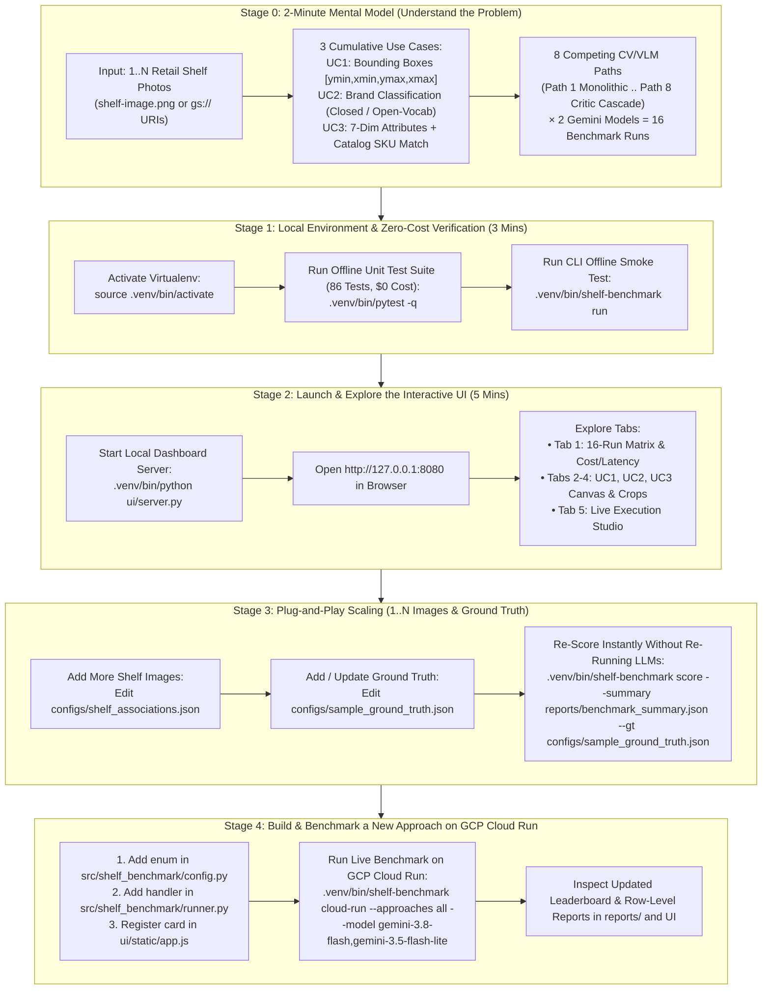
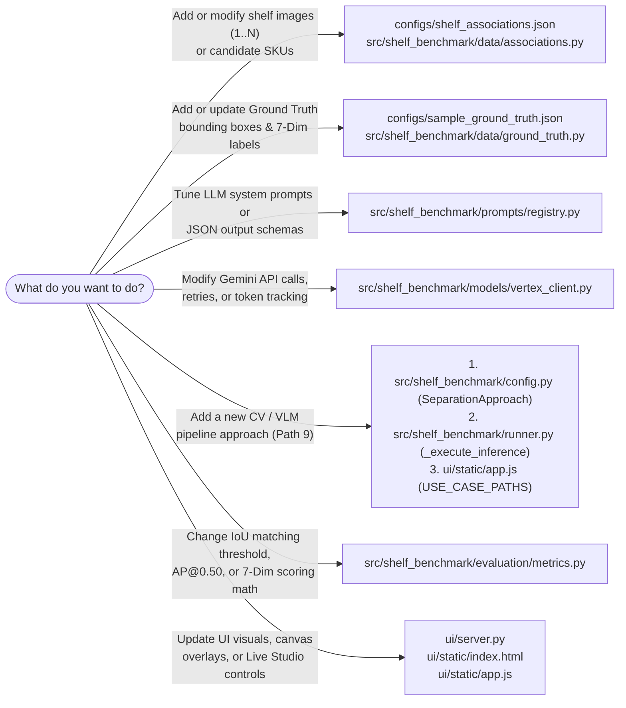

# Step-by-Step Engineering Onboarding Guide

Welcome to the **Unilever Shelf Understanding with Computer Vision & Multimodal
LLMs** repository! This guide is designed specifically for **new engineers who
have never seen this repository before**.

---

## 1. Visual Step-by-Step Onboarding Journey

Follow the 5 stages below in order. Every stage has a clear verification check
before moving to the next.

<!-- mdformat off(reason: preserving Mermaid onboarding journey diagram) -->

<!-- mdformat on -->

---

## 2. Quick-Reference Decision Map: "Which File Do I Touch?"

When you are asked to make a change, use this decision tree to jump straight to
the exact file responsible:

<!-- mdformat off(reason: preserving Mermaid file decision tree diagram) -->

<!-- mdformat on -->

---

## 3. Step-by-Step Commands for Your First 15 Minutes

### Step 1: Verify Your Environment (`$0` API Cost)

Run the automated test suite. By default, tests use `VertexAIClient(offline_mode=True)`
so they never require live GCP credentials or spend Vertex AI quota:

```bash
.venv/bin/pytest -q
```

### Step 2: Launch the Visual Inspection UI (`http://127.0.0.1:8080`)

Start the dashboard server to inspect the 16 pre-computed Cloud Run runs
(`8 paths × 2 Gemini models`) stored in `reports/`:

```bash
.venv/bin/python ui/server.py
```

* **What to look for in the UI**:
  * **Tab 1 (`Executive Overview & Architecture`)**: Compares all 16 runs side
    by side on Latency (`s`), Estimated Cost (`$`), Detected Front Facings,
    Detection F1 / `AP@0.50` / `mAP@[0.50:0.95]`, and 7-Dimension Attribute
    Accuracy. Use the **Evaluated Shelf Image Manifest (`1..N`)** dropdown to
    filter across images.
  * **Tabs 2, 3, and 4 (`Use Case 1`, `Use Case 2`, `Use Case 3`)**: Click any
    bounding box on the shelf photo or any thumbnail in the crop strip to see
    its coordinates, confidence, matched Ground Truth IoU, and all 7 taxonomy
    attributes (`category`, `subcategory`, `brand`, `variant`, `packaging`,
    `pack_type`, `size`).
  * **Tab 5 (`Live Execution Studio`)**: Execute any of the 8 paths in real time
    using **Offline Unit-Test Stub**, **Local Non-Cloud-Run Process**, or
    **Remote GCP Cloud Run Service**.

### Step 3: Run a Live Benchmark Against GCP Cloud Run

To execute all 8 approaches across both `gemini-3.8-flash` and
`gemini-3.5-flash-lite` on the remote GCP Cloud Run service and refresh
`reports/`:

```bash
.venv/bin/shelf-benchmark cloud-run \
  --approaches all \
  --model gemini-3.8-flash,gemini-3.5-flash-lite
```

### Step 4: Re-Score Existing Runs When New Ground Truth Arrives

When new Ground Truth annotations are added to `configs/sample_ground_truth.json`,
you do **not** need to re-run Vertex AI inference. Run:

```bash
.venv/bin/shelf-benchmark score \
  --summary reports/benchmark_summary.json \
  --gt configs/sample_ground_truth.json
```
