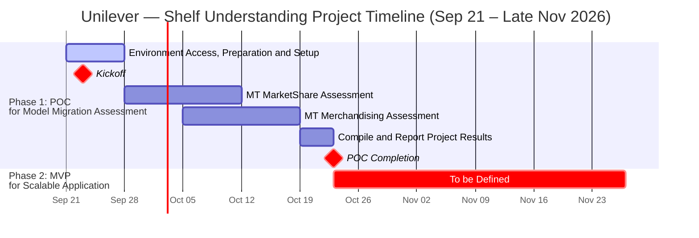

# Path to Production: Project Plan & Engagement Path
**Unilever — Shelf Understanding Project (Sales EDGE – MT PC Backend Applications)**

*This document outlines the resourcing requirements, application portfolio, model inventory, estimated timelines, key milestones, and engagement path to assess, migrate/refactor, and transition Unilever's **Shelf Understanding** backend applications under **Sales EDGE – MT PC**—including **MT MarketShare**, **MT Merchandising**, **MT Toker Compliance**, and **Share of Shelf (SOS) Pipeline**—from Proof of Concept (POC) assessment to a scalable production application and architecture within Unilever's Google Cloud Platform (GCP) environment.*

---

## 1. Document Metadata

| Field | Details | Status |
| :--- | :--- | :--- |
| **Customer Name** | Unilever | Active |
| **Engagement Type** | Path to Production (P2P) Co-Build | Scoping |
| **Estimated Duration** | Phase 1 POC: ~5 Weeks (Sep 21, 2026 – Oct 23, 2026); Phase 2: Oct 23, 2026 – Nov 27, 2026 (To Be Defined) | Draft |
| **Google Lead FDE** | [Anil Sener](mailto:anilsener@google.com) | Active |
| **Google Lead Sponsor** | [Turan Bulmus](mailto:turanbulmus@google.com) | Active |
| **Google Customer Engineers (Technical Advisory)** | Technical Support Team | Active |
| **Customer Sponsor** | Project Sponsor | Draft |
| **Customer Executive Sponsor** | Executive Sponsor | Draft |
| **Customer Technical Lead** | Technical Lead | Draft |
| **Customer SMEs** | Retail Execution, Computer Vision & Merchandising SMEs | Draft |

---

## 2. Application Portfolio & Model Inventory

### 2.1 Backend Application Scope & Daily Volume

All four backend applications serve the **Sales EDGE – MT PC** client application across Modern Trade (MT) stores:

| Client Application | Backend Application | Use Case | Images Per Day (avg) |
| :--- | :--- | :--- | :--- |
| **Sales EDGE – MT PC** | **MT MarketShare** | Processes modern trade shelf images to generate insights and recommendations using product detection and sales data. | **323,935** |
| **Sales EDGE – MT PC** | **MT Merchandising** | Evaluates merchandising execution in modern trade stores by analyzing SKU presence, placement, and compliance. | **104,571** |
| **Sales EDGE – MT PC** | **MT Toker Compliance\*** | Automates validation of promotional offers and ensures adherence to defined promotional thresholds in MT stores. | **78,025 (Dry Runs)** |
| **Sales EDGE – MT PC** | **MT SOS Pipeline\*** | Builds and processes Share-of-Shelf analytics to measure product visibility and shelf dominance in modern trade. | **NA (Currently in Pilot)** |

*\*Note: MT Toker Compliance is currently operating in Dry Runs (~78,025 images/day avg), and MT SOS Pipeline is currently in Pilot.*

### 2.2 Baseline Model Inventory (13 Models Total)

The following 13 computer vision and multimodal models underpin the General Trade (GT), Modern Trade (MT), and Merchandising pipelines under assessment:

| Component | Model Architecture | Application | Model Count | Description |
| :--- | :--- | :--- | :---: | :--- |
| **SKU Detection** | `YOLO` | GT, MT | 1 | Detects Regions of Interest (ROIs) / SKUs from a given shelf image. |
| **Brand Classification (HUL and Non-HUL)** | `XceptioNet` | GT, MT | 2 | Classifies detected ROI among HUL and Non-HUL brands. |
| **Variant Classification** | `Inceptionnet` | GT, MT | 6 | Takes Brand name and ROI image as input to classify among variants across 6 category-specific models: *Hair Care-DMT*, *Skin Care*, *Oral Care*, *Personal Wash - Laundry*, *Foods-Beverages*, and *Non-HUL*. |
| **Packaging Type** | `Inceptionnet` | GT, MT | 1 | Category-level models to detect product packaging type. |
| **Asset SKU Detection** | `YOLO` | Merchandising | 1 | Detects promotional and merchandising assets from input shelf images for promotion recognition. |
| **Promotion Recognition** | `ViT-B-16-plus-240` | Merchandising | 1 | Detects whether the promotion present on shelf matches the reference image shared by the business. |
| **Merchandising Product Recognition** | `Inceptionnet` | Merchandising | 1 | Detects products within the merchandising window. |
| **Total** | — | — | **13** | **Complete baseline model suite across GT, MT & Merchandising** |

---

## 3. Customer Resourcing Requirements

To ensure a successful delivery, robust knowledge transfer, and a smooth transition to operational ownership, Unilever will provide **5 dedicated Partner FTEs** (alongside domain SMEs) from project kickoff through completion:

*   **Partner Engineering Team (5 FTEs):**
    *   **Role & Responsibilities:** Co-assess and benchmark the 13 baseline models (`YOLO`, `XceptioNet`, `Inceptionnet`, `ViT-B-16-plus-240`) and evaluate migration pathways to **`Gemini 3.5 Flash-Lite`**, **`Gemini 3.8 Flash`**, and **`gemini-embedding`** across the target **Sales EDGE – MT PC** workloads; provision GCP environment infrastructure, configure IAM roles and storage buckets, build high-throughput image ingestion pipelines, and co-design the scalable application architecture for Phase 2.
    *   **Rationale:** Engaging a unified team of five Partner FTEs across the assessment tracks mitigates single-point-of-failure (SPOF) risks, enables flexible workload distribution across model evaluation and cloud infrastructure, and ensures complete technical ownership post-POC.
*   **Subject Matter Experts (SMEs):**
    *   **Resources:** Retail Execution Lead, Modern Trade Merchandising Specialist, Toker Promotional Compliance Lead, Share-of-Shelf Analytics Lead.
    *   **Engagement:** Participate in weekly review sessions (**1–2 times per week**) to validate category/variant taxonomies, promotional compliance thresholds, and Share-of-Shelf calculation rules.
    *   **Rationale:** Active SME feedback ensures model assessment metrics align directly with real-world retail execution and Modern Trade compliance standards.

---

## 4. Estimated Timeline & Strategic Grouping

*   **Project Start Date:** **September 21, 2026**
*   **Kickoff Milestone:** **September 23, 2026**
*   **Phase 1 POC Completion Milestone:** **October 23, 2026**
*   **Phase Grouping & Milestone Structure:**
    *   **Phase 1: POC for Model Migration Assessment (September 21 – October 23, 2026):**
        *   **Environment Setup:** **Environment Access, Preparation and Setup** (**1 Week: Sep 21 – Sep 27, 2026**).
        *   **Project Kickoff:** **Kickoff Milestone** on **Wednesday, September 23, 2026**.
        *   **Staggered Application Assessments (Sep 28 – Oct 18, 2026):**
            *   **Track 1:** **MT MarketShare Assessment** (**2 Weeks: Sep 28 – Oct 11, 2026**).
            *   **Track 2:** **MT Merchandising Assessment** (**2 Weeks: Oct 5 – Oct 18, 2026**).
        *   **Results Synthesis & Reporting:** **Compile and Report Project Results** (**1 Week: Oct 19 – Oct 23, 2026**).
        *   **Phase 1 Sign-Off:** **POC Completion Milestone** on **October 23, 2026**.
    *   **Phase 2: MVP for Scalable Application (October 23 – Late November 2026):**
        *   **Scope Status:** **To be Defined** (**Oct 23 – Nov 27, 2026**), pending outcomes and architectural recommendations from Phase 1 POC Delivery.
    *   **Phase 3: Mobile Application Integration:**
        *   **Scope & Engagement Model:** The processing pipeline and its outputs will be integrated directly into Unilever's mobile channels, with Google expected to provide advisory support rather than hands-on engineering work. *(Not shown on Gantt chart).*
    *   **Phase 4: Production Ramping (End of Q4 2026):**
        *   **Scope & Transition:** Following the architectural specification from the FDE & PSO teams, production ramping is presumed to begin towards the end of Q4 2026 as the workload migrates from Azure to GCP. During this phase, Google will also continue the handover of operational maintenance to the co-build team on the Unilever side to stabilize adoption. *(Not shown on Gantt chart).*

---

## 5. Key Milestones & Engagement Path

The engagement is structured into distinct phases reflecting Unilever's immediate application and model migration assessment priorities, MVP application build, downstream mobile integration, and production migration from Azure to GCP.

> [!IMPORTANT]
> **Timeline & Scope Notice — Phase 2 (Starting October 23, 2026 — TO BE DEFINED):**
> As visually highlighted in the Gantt chart by the **To be Defined** marker, all deliverables, application engineering tasks, and architectural implementation work in **Phase 2: MVP for Scalable Application** scheduled from **October 23, 2026 onwards** are intentionally marked as **To be Defined** pending formal review at the **POC Completion Milestone**.

---

### Milestone Breakdown by Phase

### Phase 1: POC for Model Migration Assessment (September 21 – October 23, 2026)

| Sprint | User Stories | Tasks & Owners |
| :--- | :--- | :--- |
| **Sprint 0** *(Sep 21 – Sep 27)* | **Environment Setup & Kickoff Alignment**: Provision non-production GCP environment & git repo, input training, test and reference datasets. | Google FDE & PSO Teams & Unilever Team |
| **Sprint 1** *(Sep 28 – Oct 11)* | Develop Gemini/Gemma based pipelines for **MT MarketShare** *(Sep 28 – Oct 11)* and initiate **MT Merchandising** *(starting Oct 5)*. Benchmark for latency, quality and cost against current state. | Google FDEs / Unilever & Partner Team |
| **Sprint 2** *(Oct 5 – Oct 18)* | Complete Gemini/Gemma based pipeline development and benchmarking for **MT Merchandising** for latency, quality and cost against current state. | Google FDEs / Unilever & Partner Team |
| **Sprint 3** *(Oct 19 – Oct 23)* | **Compile and Report Project Results**: Consolidate latency, quality, and cost benchmarks across **MT MarketShare** and **MT Merchandising**. Deliver **POC Completion Milestone (Oct 23)** presentation, benchmark report, and Phase 2 MVP architecture. | Google FDEs / Unilever Leads |

#### Detailed Milestone Breakdown — Phase 1

1.  **Environment Access, Preparation and Setup (Sep 21 – Sep 27, 2026)**
    *   *Goal:* Establish GCP project access, IAM service accounts, storage buckets, model artifact repositories, and benchmarking environments.
    *   *Activities:* Provision non-production GCP project resources, configure Vertex AI APIs and developer permissions, ingest baseline shelf imagery and weights for the 13-model inventory, and establish automated throughput/accuracy benchmarking harnesses.
2.  **Kickoff Milestone (Sep 23, 2026)**
    *   *Goal:* Conduct formal project kickoff with Unilever and Google stakeholders on Wednesday, September 23, 2026.
    *   *Activities:* Align on project charter, application priorities across **Sales EDGE – MT PC**, daily volume SLAs (`~324K/day` MarketShare, `~105K/day` Merchandising), and staggered execution cadence across the **MT MarketShare** and **MT Merchandising** assessments.
3.  **MT MarketShare Assessment — 2 Weeks (Sep 28 – Oct 11, 2026)**
    *   *Goal:* Assess and benchmark the high-throughput **MT MarketShare** application (`323,935 images/day avg`) and its core GT/MT model chain (`YOLO` SKU Detection, `XceptioNet` HUL/Non-HUL Brand Classification, 6 category-specific `Inceptionnet` Variant Classification models, and `Inceptionnet` Packaging Type detection), including potential migration pathways to **Gemini VLMs** and **`gemini-embedding`**.
    *   *Activities:* Benchmark multi-stage inference latency and GPU/accelerator utilization on Vertex AI; evaluate replacing the 6 category-specific `Inceptionnet` variant classifiers (*Hair Care-DMT*, *Skin Care*, *Oral Care*, *Personal Wash - Laundry*, *Foods-Beverages*, *Non-HUL*) and `XceptioNet` brand models with vector similarity search powered by the **`gemini-embedding`** model and high-throughput classification via **`Gemini 3.5 Flash-Lite`**; and establish cost/throughput baselines for processing ~324K daily shelf images.
4.  **MT Merchandising Assessment — 2 Weeks (Oct 5 – Oct 18, 2026)**
    *   *Goal:* Assess and benchmark the **MT Merchandising** application (`104,571 images/day avg`) evaluating SKU presence, placement, and merchandising compliance, including migration opportunities to **Gemini 3.8 Flash** and **Gemini 3.5 Flash-Lite**.
    *   *Activities:* Benchmark the dedicated Merchandising model pipeline (`YOLO` Asset SKU Detection, `ViT-B-16-plus-240` Promotion Recognition against business reference images, and `Inceptionnet` Merchandising Product Recognition within merchandising windows); evaluate migrating reference-image promotion verification and merchandising window compliance to **`Gemini 3.8 Flash`** (for complex visual reasoning) and **`Gemini 3.5 Flash-Lite`** / **`gemini-embedding`** (for fast asset/SKU matching); and document accuracy, latency, and cost trade-offs.
5.  **Compile and Report Project Results — 1 Week (Oct 19 – Oct 23, 2026)**
    *   *Goal:* Consolidate quantitative benchmark findings, cost/latency trade-offs, and architectural recommendations across the assessed backend applications.
    *   *Activities:* Synthesize latency, quality, and cost comparisons between the baseline 13-model suite and Gemini/Gemma/embedding pipelines across **MT MarketShare** and **MT Merchandising**, prepare executive readout materials, and finalize the Phase 2 MVP architecture specification.
6.  **POC Completion Milestone (Oct 23, 2026)**
    *   *Goal:* Deliver comprehensive POC migration assessment findings, 13-model benchmark results, Gemini VLM / embedding migration recommendations across **MT MarketShare** and **MT Merchandising**, and Phase 2 target architecture on October 23, 2026.
    *   *Activities:* Conduct formal readout with Unilever and Google stakeholders to sign off on Phase 1 results and approve the Phase 2 MVP execution roadmap.

---

### Phase 2: MVP for Scalable Application (October 23 – Late November 2026)

7.  **To be Defined (Oct 23 – Nov 27, 2026)**
    *   *Goal:* Detailed tasks, MVP scope, system integrations, and production cutover milestones will be defined upon completion of the Phase 1 POC Completion Milestone on October 23, 2026.

---

### Phase 3: Mobile Application Integration *(Advisory Support — Not on Gantt Chart)*

8.  **Mobile Channel Integration**
    *   *Goal:* Integrate the processing pipeline and its downstream analytical outputs directly into Unilever's mobile channels.
    *   *Engagement Model:* Google will provide technical advisory support rather than hands-on implementation work during this phase.

---

### Phase 4: Production Ramping *(End of Q4 2026 — Not on Gantt Chart)*

9.  **Azure-to-GCP Workload Migration & Operational Handover**
    *   *Goal:* Ramp live production workloads on Google Cloud Platform towards the end of Q4 2026 following the architectural specification established by the FDE & PSO teams.
    *   *Activities:* Migrate production workloads from Azure to GCP while continuing the structured handover of maintenance and operational ownership to the co-build team on the Unilever side to stabilize long-term adoption.
