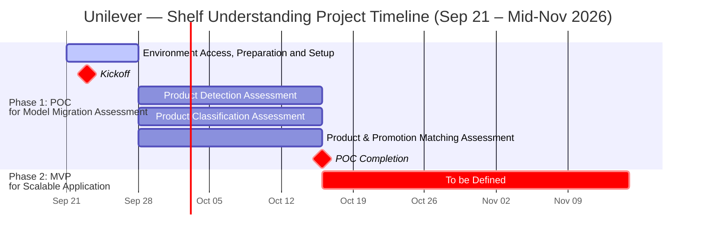

# Path to Production: Project Plan & Engagement Path
**Unilever — Shelf Understanding Project**

*This document outlines the resourcing requirements, estimated timelines, key milestones, and engagement path to assess, refactor, and transition the **Shelf Understanding** computer vision and multimodal AI capabilities—including Product Detection, Product Classification, and Product & Promotion Matching—from Proof of Concept (POC) model refactoring assessment to a scalable production application and architecture within Unilever's Google Cloud Platform (GCP) environment.*

---

## 1. Document Metadata

| Field | Details | Status |
| :--- | :--- | :--- |
| **Customer Name** | Unilever | Active |
| **Engagement Type** | Path to Production (P2P) Co-Build | Scoping |
| **Estimated Duration** | Phase 1 POC: ~4 Weeks (Sep 21, 2026 – Oct 16, 2026); Phase 2: Oct 16, 2026 – Nov 15, 2026 (To Be Defined) | Draft |
| **Google Lead FDE** | [Anil Sener](mailto:anilsener@google.com) | Active |
| **Google Lead Sponsor** | [Turan Bulmus](mailto:turanbulmus@google.com) | Active |
| **Google Customer Engineers (Technical Advisory)** | Technical Support Team | Active |
| **Customer Sponsor** | Project Sponsor | Draft |
| **Customer Executive Sponsor** | Executive Sponsor | Draft |
| **Customer Technical Lead** | Technical Lead | Draft |
| **Customer SMEs** | Retail Execution, Computer Vision & Merchandising SMEs | Draft |

---

## 2. Customer Resourcing Requirements

To ensure a successful delivery, robust knowledge transfer, and a smooth transition to operational ownership, Unilever is expected to dedicate the following engineering and subject-matter resources from project kickoff through completion:

*   **AI / Computer Vision Engineers (2 FTEs):**
    *   **Role & Responsibilities:** Co-assess and refactor computer vision and multimodal AI pipelines across Product Detection, Product Classification, and Product & Promotion Matching tracks. Benchmark model accuracy, latency, and inference cost on Vertex AI, and establish evaluation pipelines against ground-truth shelf datasets.
    *   **Rationale:** Engaging two AI/CV engineers mitigates single-point-of-failure (SPOF) risks and ensures Unilever builds deep internal competency in Vertex AI model serving, multimodal prompting, and computer vision evaluation methodologies.
*   **Backend / Cloud Engineers (2 FTEs):**
    *   **Role & Responsibilities:** Provision GCP environment infrastructure, configure IAM roles and storage buckets, build data ingestion pipelines for shelf imagery and product catalogs, and co-design the scalable application architecture for Phase 2.
    *   **Rationale:** Ensures the organization retains complete technical ownership to maintain, scale, and operate the cloud infrastructure and data pipelines post-POC.
*   **Subject Matter Experts (SMEs):**
    *   **Resources:** Retail Execution Lead, Planogram & Merchandising Specialist, Product Catalog & Promotions Data Lead.
    *   **Engagement:** Participate in weekly review sessions (**1–2 times per week**) to validate detection/classification taxonomies, SKU matching rules, and promotional compliance criteria.
    *   **Rationale:** Active SME feedback ensures model assessment metrics align directly with real-world retail execution and shelf compliance requirements.

---

## 3. Estimated Timeline & Strategic Grouping

*   **Project Start Date:** **September 21, 2026**
*   **Kickoff Milestone:** **September 23, 2026**
*   **Phase 1 POC Delivery Milestone:** **October 16, 2026**
*   **Phase Grouping & Milestone Structure:**
    *   **Phase 1: POC for Model Refactoring Assessment (September 21 – October 16, 2026):**
        *   **Environment Setup:** **Environment Access, Preparation and Setup** (**1 Week: Sep 21 – Sep 27, 2026**).
        *   **Project Kickoff:** **Kickoff Milestone** on **Wednesday, September 23, 2026**.
        *   **Parallel Model Assessment Tracks (3 Weeks: Sep 28 – Oct 16, 2026):**
            *   **Track 1:** **Product Detection Assessment** (**3 Weeks: Sep 28 – Oct 16, 2026**).
            *   **Track 2:** **Product Classification Assessment** (**3 Weeks: Sep 28 – Oct 16, 2026**).
            *   **Track 3:** **Product & Promotion Matching Assessment** (**3 Weeks: Sep 28 – Oct 16, 2026**).
        *   **Phase 1 Sign-Off:** **POC Delivery Milestone** on **October 16, 2026**.
    *   **Phase 2: Scalable Application and Architecture (October 16 – Mid-November 2026):**
        *   **Scope Status:** **To be Defined** through mid-November (**Oct 16 – Nov 15, 2026**), pending outcomes and architectural recommendations from Phase 1 POC Delivery.

---

## 4. Key Milestones & Engagement Path

The engagement is structured into two distinct phases reflecting Unilever's immediate model assessment priorities and subsequent production scaling roadmap.

> [!IMPORTANT]
> **Timeline & Scope Notice — Phase 2 (Starting October 16, 2026 — TO BE DEFINED):**
> As visually highlighted in the Gantt chart by the **To be Defined** marker, all deliverables, application engineering tasks, and architectural implementation work in **Phase 2: Scalable Application and Architecture** scheduled from **October 16, 2026 through Mid-November (November 15, 2026)** are intentionally marked as **To be Defined** pending formal review at the **POC Delivery Milestone**.

---

### Milestone Breakdown by Phase

### Phase 1: POC for Model Migration Assessment (September 21 – October 16, 2026)

1.  **Environment Access, Preparation and Setup (Sep 21 – Sep 27, 2026)**
    *   *Goal:* Establish GCP project access, IAM service accounts, storage buckets, dataset repositories, and development environments.
    *   *Activities:* Provision non-production GCP project resources, configure Vertex AI APIs and developer permissions, ingest baseline shelf imagery and ground-truth evaluation datasets, and establish benchmarking harness.
2.  **Kickoff Milestone (Sep 23, 2026)**
    *   *Goal:* Conduct formal project kickoff with Unilever and Google stakeholders on Wednesday, September 23, 2026.
    *   *Activities:* Align on project charter, success criteria, dataset readiness, evaluation metrics, and working cadence across the three parallel assessment tracks.
3.  **Product Detection Assessment — 3 Weeks (Sep 28 – Oct 16, 2026)**
    *   *Goal:* Evaluate and refactor shelf product localization models for bounding-box precision, recall, and inference throughput.
    *   *Activities:* Benchmark existing product detection models against Vertex AI vision architectures, analyze dense-shelf localization edge cases (occlusion, lighting variation, shelf angles), and document refactoring recommendations.
4.  **Product Classification Assessment — 3 Weeks (Sep 28 – Oct 16, 2026)**
    *   *Goal:* Assess and optimize fine-grained SKU and brand classification models across cropped shelf detections.
    *   *Activities:* Evaluate classification accuracy across high-cardinality SKU taxonomies, compare specialized vision backbones and multimodal embeddings, and establish retraining/indexing strategies for new packaging variants.
5.  **Product & Promotion Matching Assessment — 3 Weeks (Sep 28 – Oct 16, 2026)**
    *   *Goal:* Assess multimodal matching pipelines linking detected products, price tags, and promotional signage against master product catalogs and planograms.
    *   *Activities:* Evaluate VLM and OCR extraction pipelines for price/promotion tags, benchmark product-to-promotion spatial association logic, and measure end-to-end compliance accuracy.
6.  **POC Delivery Milestone (Oct 16, 2026)**
    *   *Goal:* Deliver comprehensive POC assessment findings, refactored model benchmarks, and Phase 2 target architecture recommendations on October 16, 2026.
    *   *Activities:* Present quantitative evaluation results across all three parallel tracks, review latency/cost trade-offs, and finalize scope and detailed task plan for Phase 2.

---

### Phase 2: Scalable Application and Architecture (October 16 – Mid-November 2026)

7.  **To be Defined (Oct 16 – Nov 15, 2026)**
    *   *Goal:* Detailed tasks, MVP scope, system integrations, and production cutover milestones will be defined upon completion of the Phase 1 POC Delivery Milestone on October 16, 2026.
