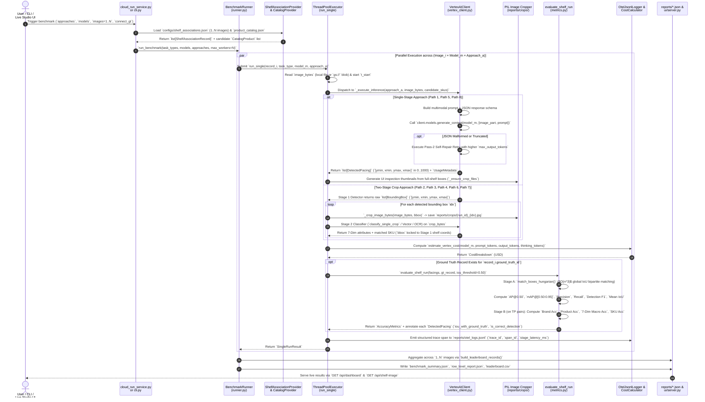
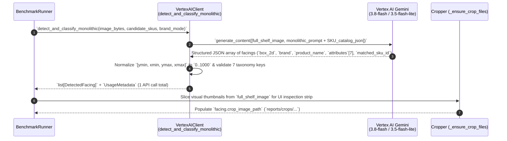
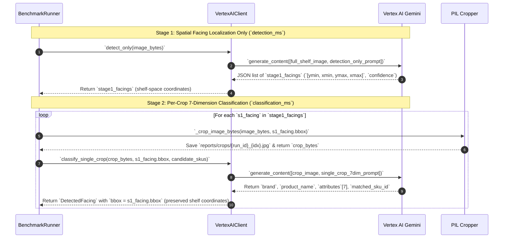
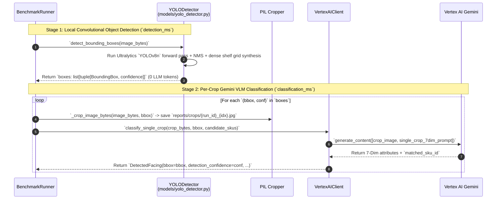
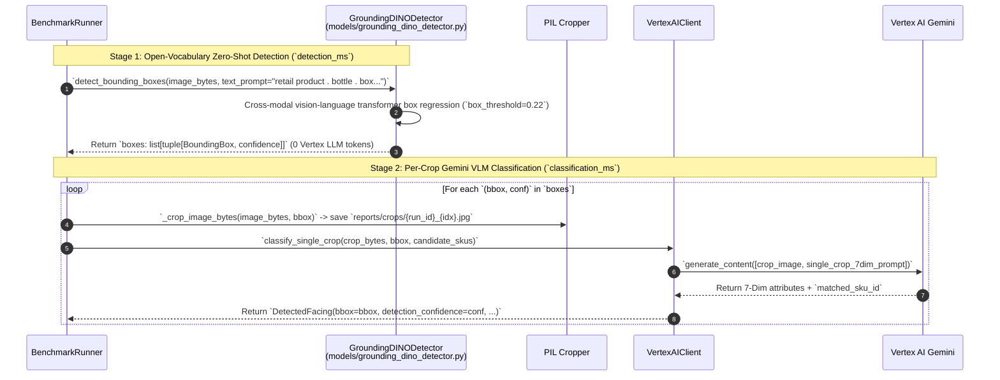
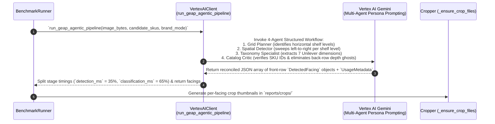
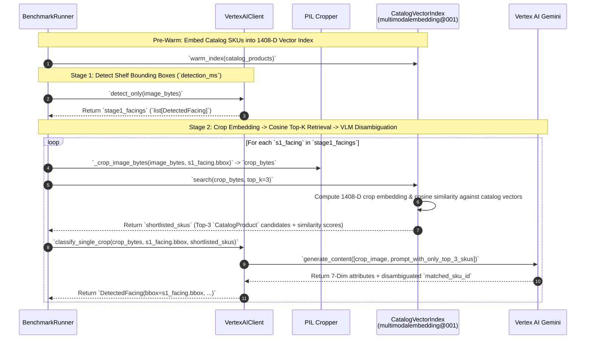
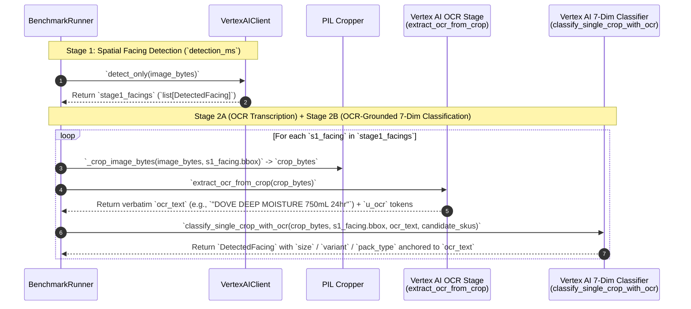
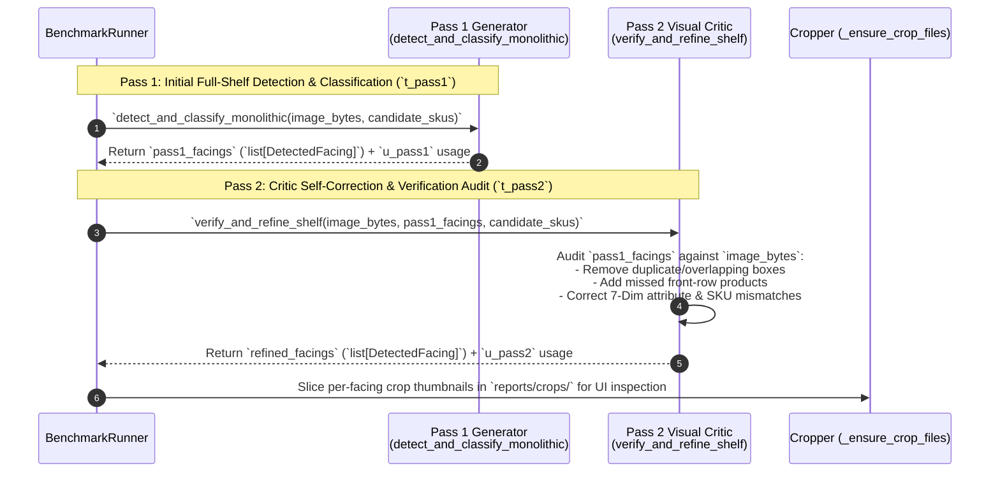

# Unilever Shelf Understanding — Execution & Extensibility Sequence Diagrams

This document contains the complete set of sequence diagrams for the Unilever
Shelf Understanding platform:

1. **Adding a New Approach & Running It** (End-to-End Extensibility Lifecycle)
2. **Running the Benchmark System in Detail** (Deep Runtime Execution Sequence)
3. **Individual Execution Sequence Diagrams for All 8 Current Paths (`Path 1` – `Path 8`)**

---

## 1. Sequence Diagram: Adding a New Approach Plugin (Design, Implementation & Contract Binding)

This diagram details the complete workflow for an engineer authoring, scaffolding, and registering a new approach plugin (e.g., `custom_cv_vlm`). Because the framework uses an **Auto-Discovery Plugin Architecture**, new approaches are added entirely within their own module or script—**zero modifications are needed to core engine files** (`runner.py`, `config.py`, `tasks/`, or `ui/`).

*(Note: Runtime benchmark execution is intentionally excluded here and detailed separately in Section 2).*

<!-- mdformat off(reason: preserving Mermaid sequence diagram) -->
```mermaid
sequenceDiagram
    autonumber
    actor Eng as Engineer
    participant PluginPkg as approaches/<custom_id>/plugin.py<br/>(or standalone script)
    participant Base as approaches/base.py<br/>(SimpleShelfApproachPlugin)
    participant Ctx as CommonLayerContext<br/>(Shared Infrastructure)
    participant Pipe as pipeline.py<br/>(PipelineExecutor)
    participant Registry as approaches/registry.py<br/>(GLOBAL_APPROACH_REGISTRY)
    participant Discovery as CLI / UI Discovery<br/>(list-approaches / UI Studio)

    Note over Eng,PluginPkg: Phase 1: Architecture & Scaffolding
    Eng->>PluginPkg: 1. Scaffold plugin directory: `src/shelf_benchmark/approaches/<custom_id>/`
    Eng->>PluginPkg: 2. Create `plugin.py` subclassing `SimpleShelfApproachPlugin` (or use `@register_approach_function`)
    Eng->>PluginPkg: 3. Define metadata properties:
    Note right of PluginPkg: • approach_id: unique slug (e.g., "custom_cv_vlm")<br/>• display_name: human-readable title<br/>• category: "two_stage_vlm" | "vlm_multimodal" | "classic_cv"<br/>• task_type: "classification" (default) or "detection"<br/>• stages_description: list of stage summaries

    Note over Eng,Ctx: Phase 2: Implement Inference & Bind Shared Helpers
    Eng->>PluginPkg: 4. Implement `detect_and_classify(self, ctx, model_name, record)`
    PluginPkg->>Ctx: 5. Connect shared image loader: `ctx.load_shelf_image(record)`
    opt If chaining from a prior Stage 1 detector
        PluginPkg->>Ctx: 5a. Consume locked coordinates: `ctx.get_prior_detected_boxes(prior_detection)`
    end
    PluginPkg->>Ctx: 6. Access unified GenAI / Vertex client: `ctx.get_client()`
    PluginPkg->>Ctx: 7. Apply geometric 1D-NMS: `ctx.deduplicate_depth_stacked_facings(candidates)`
    Note right of PluginPkg: Candidate dicts populate standard keys:<br/>`bbox_2d` [ymin,xmin,ymax,xmax] (0..1000), `brand`,<br/>`product_name`, `variant`, `category`, `packaging_type`,<br/>`size`, `confidence`, plus custom attributes (>8 attrs).

    Note over PluginPkg,Pipe: Phase 3: Contract Binding & Automatic Pipeline Wrapping
    Base->>Pipe: 8. `SimpleShelfApproachPlugin.execute()` delegates to `ctx.execute_with_pipeline()`
    Pipe->>Pipe: 9. Pre-bind execution wrapper with `InvocationContext`:
    Note right of Pipe: • Config-driven RetryPolicy (offline: NO_RETRY; live: max_attempts=3)<br/>• Process CPU time measurement (`time.process_time()`)<br/>• Rule-derived size bucketing (`derive_size_bucket_from_bbox`)<br/>• HUL brand portfolio matching (`check_is_hul_brand`)<br/>• 5-Bucket GCP Cost Attribution Engine<br/>• Ground-truth accuracy evaluation (Hungarian IoU + per-attribute)<br/>• OpenTelemetry span generation (`otel_logs.jsonl`)

    Note over Registry,Discovery: Phase 4: Dynamic Auto-Discovery & Exposure
    Registry->>PluginPkg: 10. `GLOBAL_APPROACH_REGISTRY.discover_all()` dynamically scans `approaches/*/plugin.py`
    Registry->>Registry: 11. Inspect classes and factories (`get_plugins()`), validating `BaseShelfApproachPlugin` contract
    Registry->>Registry: 12. Register instance into `_plugins[approach_id]`
    Registry-->>Discovery: 13. Expose new approach to ecosystem:
    Discovery-->>Eng: • `shelf-benchmark list-approaches` outputs new ID with `source=plugin`<br/>• CLI `--approaches <custom_id>` accepts the new approach<br/>• UI `/api/dashboard` and Live Studio dropdowns auto-populate with zero code edits
```
<!-- mdformat on -->

---

## 2. Detailed Sequence Diagram: Running the Benchmark Pipeline (Runtime Deep-Dive)

This diagram isolates **runtime execution only**, detailing how `1..N` shelf
images, candidate catalog SKUs, Vertex AI structured inference, crop generation,
Hungarian bipartite Ground Truth evaluation, and OpenTelemetry billing/tracing
interact during a live run.

<!-- mdformat off(reason: preserving Mermaid detailed runtime sequence diagram) -->

<!-- mdformat on -->

---

## 3. Execution Sequence Diagrams for All 8 Current Approaches (`Path 1` – `Path 8`)

Below are the 8 dedicated execution sequence diagrams corresponding to each of
the 8 architectural paths implemented in
[`BenchmarkRunner._execute_inference`](file:///usr/local/google/home/rgavigan/unilever-shelf-understanding-with-cv/src/shelf_benchmark/runner.py#L406-L772).

### Path 1: `monolithic_llm` — Single-Shot End-to-End Multimodal LLM

One multimodal Gemini call receives the full high-resolution shelf image and
simultaneously outputs every front-facing `[ymin, xmin, ymax, xmax]` bounding
box, all 7 product taxonomy dimensions, and the matched catalog SKU.

<!-- mdformat off(reason: preserving Path 1 Mermaid sequence diagram) -->

<!-- mdformat on -->

---

### Path 2: `two_stage_detection_first` — Two-Stage LLM Detector $\rightarrow$ Crop Classifier

Decouples spatial localization from fine-grained attribute reading: Stage 1 asks
Gemini exclusively for front-facing bounding boxes; PIL slices high-resolution
image crops; Stage 2 classifies each crop independently across all 7 dimensions.

<!-- mdformat off(reason: preserving Path 2 Mermaid sequence diagram) -->

<!-- mdformat on -->

---

### Path 3: `hybrid_yolo_gemini` — Local YOLOv8n Proposals $\rightarrow$ Gemini VLM Classifier

Replaces the Stage 1 LLM detector with an ultra-fast local **YOLOv8n**
convolutional detector (`yolov8n.pt`) for deterministic sub-second bounding box
proposals, followed by Gemini 7-Dimension classification on each crop.

<!-- mdformat off(reason: preserving Path 3 Mermaid sequence diagram) -->

<!-- mdformat on -->

---

### Path 4: `grounding_dino_gemini` — Zero-Shot Grounding DINO $\rightarrow$ Gemini VLM Classifier

Uses **Grounding DINO** (`IDEA-Research/grounding-dino-base`) prompted with
retail text queries (`"retail product . bottle . jar . box . deodorant .
shampoo"`) for zero-shot open-vocabulary localization, followed by Gemini crop
classification.

<!-- mdformat off(reason: preserving Path 4 Mermaid sequence diagram) -->

<!-- mdformat on -->

---

### Path 5: `geap_end_to_end` — GEAP 4-Agent Orchestration Pipeline

Executes a 4-Persona Google Enterprise Agentic Pipeline (**Agent 1: Shelf Grid
Planner** $\rightarrow$ **Agent 2: Spatial Facing Detector** $\rightarrow$
**Agent 3: Brand & 7-Dim Specialist** $\rightarrow$ **Agent 4: Catalog Critic &
SKU Reconciler**).

<!-- mdformat off(reason: preserving Path 5 Mermaid sequence diagram) -->

<!-- mdformat on -->

---

### Path 6: `embedding_vector_search` — Multimodal Embedding + Vector Index Top-$K$ + VLM

Uses `multimodalembedding@001` (`1408-D` vectors) and `CatalogVectorIndex`
cosine similarity search to shortlist the top-$K$ (`K=3`) closest catalog SKUs
for each crop before invoking Gemini VLM disambiguation.

<!-- mdformat off(reason: preserving Path 6 Mermaid sequence diagram) -->

<!-- mdformat on -->

---

### Path 7: `ocr_augmented_vlm` — Crop Detection $\rightarrow$ Dedicated OCR Pre-Extraction $\rightarrow$ Grounded VLM

Adds a dedicated high-resolution crop **OCR pre-extraction step**
(`extract_ocr_from_crop`) to read tiny printed pack sizes (`750ml`, `250ml`),
multi-pack counts (`2-Pack`), and variant text before feeding those verbatim OCR
strings into the 7-Dimension VLM classifier.

<!-- mdformat off(reason: preserving Path 7 Mermaid sequence diagram) -->

<!-- mdformat on -->

---

### Path 8: `critic_verify_cascade` — Self-Correction / Critic Verification Cascade

Runs a two-pass **Generator $\rightarrow$ Critic Cascade**: Pass 1 generates
initial full-shelf detections and 7-Dimension classifications; Pass 2 invokes a
Visual Critic (`verify_and_refine_shelf`) that inspects the shelf image
alongside Pass 1's JSON output to prune false positives, merge duplicate boxes,
recover missed facings, and fix misread attributes.

<!-- mdformat off(reason: preserving Path 8 Mermaid sequence diagram) -->

<!-- mdformat on -->
