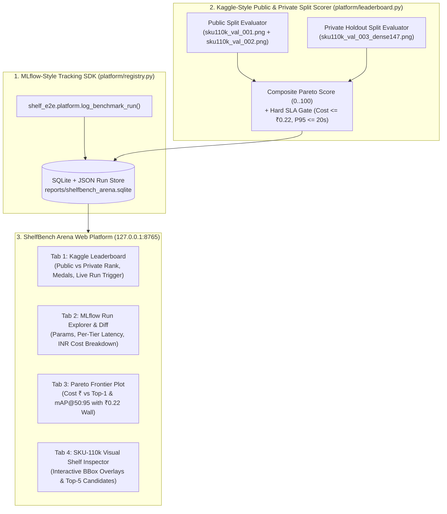

# SPEC-003: ShelfBench Arena — MLflow + Kaggle Benchmarking Platform (`PLATFORM_DESIGN.md`)

## 1. Architectural Intent ("Design is the New Code")
Unify **MLflow Experiment Tracking** (parameters, metrics, per-tier telemetry, artifacts, SQLite run registry) and **Kaggle Competition Benchmarking** (Public vs. Private holdout dataset splits, automated submission scoring, medal tiers, and SLA gatekeeping) into a zero-dependency, self-hosted platform (`ShelfBench Arena`).

## 2. Composite Pareto Scoring Formula & SLA Gates
Every run is evaluated on both the **Public Split** and the **Private Holdout Split**:
- **Raw Quality Score (`0..100`):**
  $$\text{Quality} = 100 \times \left(0.35 \cdot \text{mAP}_{50:95} + 0.35 \cdot \text{Top1Acc} + 0.15 \cdot \text{MRR} + 0.15 \cdot (1 - \text{HallucinationRate})\right)$$
- **SLA Gatekeeping (`SPEC-001`):**
  - `within_cost_sla`: `estimated_cost_inr <= 0.22`
  - `within_latency_sla`: `p95_latency_ms <= 20000.0`
  - `schema_adherence == 1.0`
- **Pareto Composite Score (`0..100`):**
  $$\text{ParetoScore} = \text{Quality} - 25.0 \cdot \mathbb{I}(\text{Cost} > \text{₹}0.22) - 25.0 \cdot \mathbb{I}(\text{P95} > 20\text{s})$$
