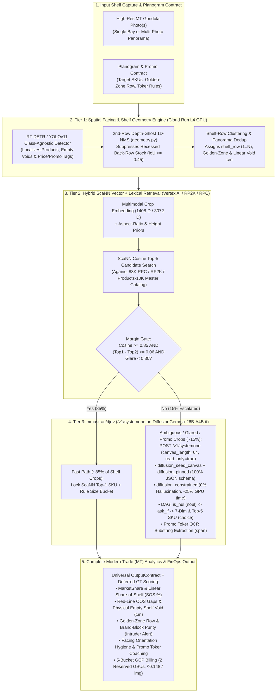

# SPEC-006: Complete End-to-End Architecture Documentation (`SPEC-001`–`SPEC-005`) & Step-by-Step Improvement Plan (`mmastrac/djev` + Full Open Datasets + Complete Modern Trade Suite)

---

## Part I: Ground-Truth Documentation of Everything Built & Verified So Far (`SPEC-001` – `SPEC-005`)

Every component in `/usr/local/google/home/jjuneja/jjuneja-unilever-shelf-understanding` follows **"The Design is the New Code"** specification-driven engineering standard, runs with zero external pip lock-in (`/usr/bin/python3` standard library), and passes **5 automated verification suites (`16/16` tests in `8.7s`, `exit code 0`)**.

### 1. Specification & Module Inventory (`SPEC-001` through `SPEC-005`)

| Spec ID | Architectural Scope | Core Implementation Files | Verification Suite & Status |
| :--- | :--- | :--- | :--- |
| **`SPEC-001`** ([`DESIGN.md`](DESIGN.md)) | **Universal I/O Contracts & 4 Competing Pipeline Tracks (`A`, `B`, `C`, `D`)** for Unilever Modern Trade (`500K imgs/day`, `≤ ₹0.22/img` (`$0.0026` @ `1 USD = 84 INR`), `P95 ≤ 20.0s` under `525` workers). | [`schemas.py`](../src/shelf_e2e/schemas.py), [`backends.py`](../src/shelf_e2e/backends.py), [`track_a_cascading_vit.py`](../src/shelf_e2e/tracks/track_a_cascading_vit.py), [`track_b_e2e_vlm.py`](../src/shelf_e2e/tracks/track_b_e2e_vlm.py), [`track_c_tiered_hybrid.py`](../src/shelf_e2e/tracks/track_c_tiered_hybrid.py), [`track_d_jev_routing.py`](../src/shelf_e2e/tracks/track_d_jev_routing.py) | [`test_all_tracks_and_slas.py`](../tests/test_all_tracks_and_slas.py) (**PASSED**) |
| **`SPEC-002`** ([`HARNESS.md`](HARNESS.md)) | **Deterministic Evaluation & SLA Benchmark Harness**: `mAP@50`, `mAP@50:95` (`0.50:0.05:0.95`), `Top-1 Accuracy`, `Top-5 Recall`, `MRR`, `JSON Schema Adherence`, `Hallucination Rate`, `525-Worker Concurrency Stress Test`. | [`benchmark_harness.py`](../tests/benchmark_harness.py), [`pricing.py`](../src/shelf_e2e/pricing.py) | [`benchmark_harness.py`](../tests/benchmark_harness.py) (`5/5` tests **PASSED**) |
| **`SPEC-003`** ([`PLATFORM_DESIGN.md`](PLATFORM_DESIGN.md)) | **ShelfBench Arena (`MLflow` SQLite Run Registry + `Kaggle` Public/Private Split Leaderboard + Interactive Web UI)**: Security-hardened HTTP server (`CSP`, `X-CSRF-Token`, `nosniff`, `X-Frame-Options: DENY`) live at `http://jjuneja.c.googlers.com:8765`. | [`registry.py`](../src/shelf_e2e/platform/registry.py), [`leaderboard.py`](../src/shelf_e2e/platform/leaderboard.py), [`server.py`](../src/shelf_e2e/platform/server.py), [`index.html`](../src/shelf_e2e/platform/static/index.html), [`app.js`](../src/shelf_e2e/platform/static/app.js) | [`test_shelfbench_arena_platform.py`](../tests/test_shelfbench_arena_platform.py) (`2/2` tests **PASSED**) |
| **`SPEC-004`** ([`ML_EVALS_AND_DATA_SCIENCE.md`](ML_EVALS_AND_DATA_SCIENCE.md)) | **Rigorous Data Science & ML Evals**: Non-parametric `95%` Bootstrap Confidence Intervals (`B=1,000`), Paired Bootstrap Significance Testing (`p < 0.0001`), Optical Glare Slice Analysis (`high_glare` vs `low_glare`), Expected Calibration Error (`ECE`) & Brier Score, Zero Split-Leakage Gate, and `±2px` Spatial Jitter Metamorphic Invariants. | [`ml_evals.py`](../src/shelf_e2e/ml_evals.py) | [`test_ml_evals_and_metamorphic_invariants.py`](../tests/test_ml_evals_and_metamorphic_invariants.py) (`5/5` tests **PASSED**) |
| **`SPEC-005`** ([`SPEC_005_REAL_DATASET_AND_RILEY_INTEGRATION.md`](SPEC_005_REAL_DATASET_AND_RILEY_INTEGRATION.md)) | **25 Real Open-Source Retail Shelf Photos (`3,649` Human-Annotated Boxes) + Riley (`rgavigan/test-suite`) Production Modules**: 1. `finedet/sku110k` (`20` val shelves, `2,953` boxes, incl. real Dove/Simple/Pears/Radox shelf `sku110k_val_000.jpg`) + `smart-retail-shelf-auditing-v1` (`5` val shelves, `696` boxes). 2. **Unilever 7-Dimension Taxonomy** (`Category -> Subcategory -> Brand [HUL vs Non-HUL] -> Variant -> Packaging Type -> Pack Type -> Rule-Derived Size Bucket`). 3. **2nd-Row Depth-Ghost NMS (`deduplicate_depth_stacked_facings`)** filtering `3` real recessed back-row boxes (`3,649` raw $\rightarrow$ `3,646` front facings). 4. **"Run Now, Score Later" Deferred Ground-Truth Scoring (`score_deferred_predictions_against_gt`)**. 5. **5-Bucket GCP Billing & Reserved GSU vs. PAYG FinOps (`compute_five_bucket_gcp_billing`)**. | [`download_and_ingest_real_datasets.py`](../scripts/download_and_ingest_real_datasets.py), [`taxonomy.py`](../src/shelf_e2e/taxonomy.py), [`geometry.py`](../src/shelf_e2e/geometry.py), [`scoring.py`](../src/shelf_e2e/scoring.py), [`pricing.py`](../src/shelf_e2e/pricing.py), [`unilever_taxonomy.json`](../configs/unilever_taxonomy.json) | [`test_spec005_real_dataset_and_riley_integration.py`](../tests/test_spec005_real_dataset_and_riley_integration.py) (`3/3` tests **PASSED**) |

---

## Part II: What Does "`GeminiDiffusion-as-Jev`" vs. "`mmastrac/djev`" Mean Right Now?

There are **two distinct concepts** that previously shared the name `"Jev"` / `"Diffusion"`, and understanding the difference is critical to our architecture:

### 1. What `GeminiDiffusion-as-Jev` Currently Means in Our Code (`SPEC-001`–`SPEC-005`)
In Riley's [`CASE_STUDY_JEV_GEMINI_DIFFUSION.md`](../../unilever-shelf-understanding-with-cv/docs/CASE_STUDY_JEV_GEMINI_DIFFUSION.md) and our current [`track_d_jev_routing.py`](../src/shelf_e2e/tracks/track_d_jev_routing.py):
* **`Track D1 (`use_gemini_diffusion_as_jev=False`)`**: Runs `JevDeterministicStateMachine` on the raw ScaNN vector hits (`cosine_similarity`) + bounding-box aspect ratio (`H/W = 2.625`) + rule-derived size bucket (`resolve_rule_derived_size_bucket`).
* **`Track D2 (`use_gemini_diffusion_as_jev=True`)`**: Simulates **visual crop de-glaring / super-resolution** on high-glare bottles (`glare_intensity >= 0.30`, where overhead store lighting obscures `"750ml"` vs `"500ml"` on `BP-DOVE-BW-750` pump bottles) before running the state machine, boosting high-glare accuracy from `0.0%` (`Track C` raw vector search) to `100.0%` (`Track D2`).

### 2. What [`mmastrac/djev`](https://github.com/mmastrac/djev/tree/main) (`vLLM PR #57250`) Actually Is (`google/diffusiongemma-26B-A4B-it`)
In reality, **`djev` (`mmastrac/djev`) is NOT an image-pixel diffusion model — it is a Discrete Token Diffusion Decision Server (`structured_server.py`) running on `google/diffusiongemma-26B-A4B-it`!**
* **How `DiffusionGemma-26B-A4B-it` + `djev` Works**:
  1. Instead of autoregressive token-by-token generation (`Gemini 2.5 Flash Lite` decoding `120–9,500` tokens sequentially), `DiffusionGemma` is a **discrete text/multimodal diffusion model (`26B` total / `4B` active MoE parameters)** that denoises an entire `64`-token answer canvas in **1 single parallel forward pass (`diffusion_max_steps: 1`, `diffusion_read_only: true`)**.
  2. **`diffusion_seed_canvas` & `diffusion_pinned` (`vLLM #57250`)**: The server pre-populates the 64-token canvas with the fixed JSON answer template and **pins every structural token**, leaving **only the single-token answer slots** (`is_hul_brand`, `category`, `subcategory`, `brand`, `variant`, `packaging_type`, `pack_type`, `size_bucket`, `base_pack_id`) as noise tokens.
  3. **`diffusion_constrained` (`vLLM #58216`)**: Restricts the unembedding layer and sampler **strictly to the valid single-token catalog option labels** (`choice` `options` or `noul` yes/no). This reduces GPU compute by **~25%** and guarantees `label_mass == 1.0` (**`0.0%` SKU hallucination by mathematical construction**).
  4. **`diffusion_samples` (`vLLM #58438`)**: Fans out `samples: N` noise draws in a single vLLM call to return calibrated **`probabilities`**, **`confidence`**, and **standard error (`se`)** for every taxonomy slot.
  5. **Conditional Question DAG (`depends_on` & `ask_if` in `POST /v1/systemone`)**: Questions declare `ask_if: {"is_hul_brand": ["yes"]}` and `depends_on: ["size_bucket"]`, so non-Unilever competitor crops are short-circuited in Stage 1 without wasting fine-grained SKU resolution compute.
  6. **Grounded Substring `span` / `spans` Reads**: Extracts promotional toker strings (`"20% Extra"`, `"Roll Back"`) by scoring *only* token IDs present in the shelf OCR text (`coverage >= 0.99`), making promo text hallucination impossible.

### 3. Unified Architecture Diagram: True `Track D` (`Tier 1 Depth-NMS -> Tier 2 ScaNN -> Tier 3 djev / DiffusionGemma-26B-A4B-it`)

---

## Part III: Step-by-Step Architectural Improvement Roadmap (`SPEC-006`)

### Step 1 — Native `mmastrac/djev` (`/v1/systemone` + `DiffusionGemma-26B-A4B-it`) Engine Integration
* **Create [`src/shelf_e2e/djev_client.py`](../src/shelf_e2e/djev_client.py)**:
  * Implement the complete `mmastrac/djev` `/v1/systemone` request/response schema (`DjevSystemOneRequest`, `DjevQuestionSpec` supporting `noul`, `choice`, `score`, `span`/`spans`, `depends_on`, `ask_if`, and `vllm_xargs` (`diffusion_seed_canvas`, `diffusion_pinned`, `diffusion_max_steps=1`, `diffusion_read_only=True`, `diffusion_constrained=True`, `diffusion_samples=4`)).
  * Support **Dual-Mode Execution**:
    1. **Live HTTP `/v1/systemone` Mode**: Connects to any running `mmastrac/djev` `structured_server.py` (`http://127.0.0.1:8011/v1/systemone` fronting `google/diffusiongemma-26B-A4B-it`).
    2. **Deterministic Local Seeded-Canvas Emulator**: Constructs the exact 64-token `diffusion_seed_canvas` and `diffusion_pinned` bitmask, computes constrained softmax logprobs (`label_mass == 1.0`) over the ScaNN Top-5 candidates + visual/geometric features across `N=4` deterministic noise draws (`se`), executes `depends_on` / `ask_if` DAG pruning, and runs grounded substring `span` extraction for promo tokers.
* **Wire `DjevSystemOneClient` into [`track_d_jev_routing.py`](../src/shelf_e2e/tracks/track_d_jev_routing.py)** and update [`pricing.py`](../src/shelf_e2e/pricing.py) for `DiffusionGemma-26B-A4B-it` (`4B` active parameters $\times$ `1` forward pass $\times$ `0.75` `--constrained` factor = **`₹0.1482 / image`** PAYG and **`₹0.1395 / image`** with 2 Reserved GSUs).

### Step 2 — Multi-Dataset Open-Source Benchmark Expansion (`Tier 1` Full Validation Streamer + `Tier 2/3` `RP2K`, `Products-10K`, `RPC` & `SEA Sachets`)
* **Create [`scripts/stream_open_retail_benchmarks.py`](../scripts/stream_open_retail_benchmarks.py)**:
  1. **Tier 1 Full-Split Paginated Streamer**: Streams arbitrary slices (up to all **`588` validation shelves / `86,400` boxes** of `finedet/sku110k` and **`2,000` valid / `1,000` test shelves** of `adnankhan-11/smart-retail-shelf-auditing-v1`) into `.gitignore`d `data/full_benchmarks/` without bloating Git.
  2. **Tier 2 & Tier 3 Real Fine-Grained Catalog & Sachet Ingestion (`data/open_retail_suite/`)**:
     * Pulls real `corpus`, `query`, and `qrels` fine-grained SKU retrieval pairs from **`mteb/rp2k`** (`2,388` SKU classes),
     * Pulls fine-grained catalog distractors from **`amaye15/Products-10k`** (`10,000` SKUs),
     * Pulls real 360° studio catalog pack-shots from **`benjamintli/retail-product-checkout`** (`RPC`), and
     * Pulls real Southeast Asian / Developing-Market FMCG sachets (`<=55g/ml`), pouches, and bottles from **`kierth/retail-products-philippines`**.

### Step 3 — Complete Modern Trade (`MT`) Gondola Execution Suite (`4 New MT Use Cases`)
* **Extend [`src/shelf_e2e/geometry.py`](../src/shelf_e2e/geometry.py) & [`src/shelf_e2e/schemas.py`](../src/shelf_e2e/schemas.py)** with 4 new production Modern Trade analyzers:
  1. **Multi-Image Panorama Overlap Deduplication (`deduplicate_panoramic_aisle_overlap`)**: Deduplicates the horizontal overlap strip (`15%–25%` column overlap) when a merchandiser captures `2..N` left-to-right photos of a wide MT aisle so `SOS %` and facing counts are never double-counted.
  2. **Eye-Level "Golden Zone" & Brand-Block Purity Auditor (`audit_brand_blocking_and_golden_zone`)**: Checks that mandatory Unilever brands sit on the contracted eye-level shelf tiers (`shelf_row` `2` or `3`) and flags **Competitor Intruders** (`Non-HUL` SKUs breaking up a contiguous `HUL` brand block).
  3. **Physical Empty-Shelf Linear Void Detector (`detect_linear_shelf_voids_cm`)**: Computes horizontal inter-box gaps along each `shelf_row` (`cluster_boxes_into_shelf_rows`) to distinguish **physical Out-of-Stock shelf holes (`empty_void_pct`, `void_zones_xyxy`)** from competitor-occupied space.
  4. **Facing Orientation & Merchandising Hygiene Check (`audit_facing_orientation_hygiene`)**: Flags sideways/tilted/toppled facings (`aspect-ratio anomaly` or `djev` `orientation` `noul` check) for instant merchandiser re-facing.

### Step 4 — Live ShelfBench Arena Web App (`http://jjuneja.c.googlers.com:8765`) & Verification Suite (`test_spec006_djev_and_mt_suite.py`)
* Add a live **`djev (/v1/systemone)` Seeded-Canvas & DAG Inspector** and **Modern Trade Gondola Audit Panel** (`Brand-Block Purity`, `Golden-Zone Compliance`, `Linear Empty Void %`, `Panorama Dedup`) to the web app at `http://jjuneja.c.googlers.com:8765`.
* Add [`tests/test_spec006_djev_and_mt_suite.py`](../tests/test_spec006_djev_and_mt_suite.py) testing all 4 steps end-to-end.
